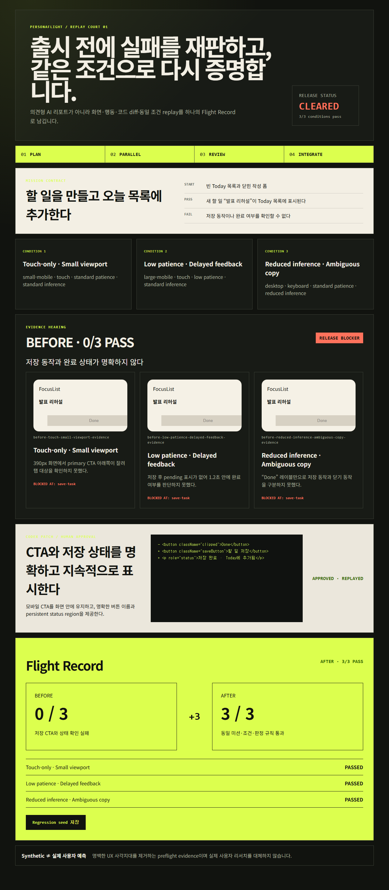
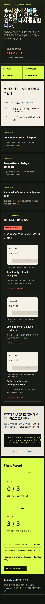

# PersonaFlight Replay Court

1인 바이브코더가 앱을 출시하기 전에 세 가지 공개된 사용 조건으로 핵심 미션을 검증하고, 발견된 실패를 Codex 최소 수정안과 사람 승인, 동일 조건 재실행까지 연결하는 프리플라이트 UX 검증 MVP입니다.

> Synthetic evidence는 실제 사용자 조사나 인구집단 예측을 대체하지 않습니다. 출시 전 명백한 UX 사각지대를 줄이기 위한 재현 가능한 보조 증거입니다.

## 왜 다른가

일반적인 AI UX 평가는 “이 사용자는 불편할 것 같다”는 의견에서 끝나기 쉽습니다. Replay Court는 다음 증거 사슬을 제품의 중심으로 둡니다.

```text
Mission Contract
→ 공개된 3개 fault condition 병렬 실행
→ screen/action evidence가 있는 blocker
→ Codex 최소 patch diff
→ 사람 승인
→ 동일 mission·condition 재실행
→ before/after Flight Record와 regression seed
```

연령이나 성별로 능력을 추정하지 않고 viewport, 입력 방식, 기다림 허용도, 문구 추론 부담처럼 재현 가능한 조건을 독립적으로 다룹니다.

## 현재 데모

- Mission: 새 할 일 “발표 리허설”을 Today 목록에 추가
- Condition 1: Touch-only + small viewport
- Condition 2: Low patience + delayed feedback
- Condition 3: Reduced inference + ambiguous copy
- Before: 0/3 pass와 세 개의 evidence ID
- Review: 저장 CTA와 상태 피드백을 고치는 최소 diff
- Approval: 개발자가 승인해야 replay 가능
- After: 동일 조건 3/3 pass와 다운로드 가능한 regression seed
- Partial safety: 한 조건이라도 실패하면 `CLEARED`가 아닌 `HOLD` 유지

## 실행

Node.js 22.14 이상을 권장합니다.

macOS, Linux, Windows PowerShell에서 공통으로 다음 순서로 실행합니다.

```bash
git clone https://github.com/sunnn62/Codex-Hackaton-02.git
cd Codex-Hackaton-02
npm ci
npm run dev
```

Windows에서 실행 파일 확장자가 필요한 경우에만 `npm.cmd`를 사용합니다.

```powershell
npm.cmd ci
npm.cmd run dev
```

브라우저에서 `http://localhost:3000`을 엽니다. 데모 실행에는 API key나 계정이 필요하지 않습니다.

## 품질 검증

```powershell
npm.cmd run test
npm.cmd run lint
npm.cmd run test:coverage
npm.cmd run build
```

현재 integration CI에서 unit/component 27개, integration 1개, Playwright E2E 2개, production build가 통과했습니다. 라인 커버리지는 96.52%이며 desktop keyboard 흐름, 390×844 touch 흐름, 가로 overflow 검증과 실제 화면 artifact가 CI에 남아 있습니다. PC4의 로컬 browser sandbox에서는 Chromium launch가 차단됐으나, 이는 CI의 제품 검증과 분리된 실행 환경 제약입니다.

```powershell
npm.cmd run test:integration
npm.cmd run test:e2e
```

## 검증 화면

CI의 E2E 테스트가 동일 흐름을 실행한 뒤 데스크톱과 모바일 touch 화면을 증거로 첨부합니다.





## 구조

```text
src/app/                         Next.js App Router 화면
src/components/                  Replay Court 인터랙션과 UI
src/lib/contracts/               Zod 기반 불변 제품 계약
src/lib/replay/                  결정론적 before/after demo record
src/lib/runner/                  URL·행동 안전 정책
tests/unit/                      계약·엔진·UI·안전 정책 테스트
tests/integration/               Flight Record JSON round-trip 테스트
tests/e2e/                       desktop keyboard·mobile touch 핵심 흐름
docs/team/                       4-PC Codex 작업 가이드
docs/BUILD_LOG.md                Plan/Parallel/Review/Integrate 증거
docs/VALUE_AND_VIABILITY.md      사용자 가치와 사업 검증 가설
```

## 4-PC Codex Orchestration

- PC1 Integrator: 공용 계약, CI, review, merge
- PC2 Product UI: 20초 안에 이해되는 화면과 반응형·접근성
- PC3 Replay Engine: evidence gate, identical replay, partial verdict
- PC4 Release QA: integration/E2E, 데모 영상, 제출 문서와 실제 링크 검증

시작 방법은 [`docs/team/START_HERE.md`](docs/team/START_HERE.md), 전체 병렬화 전략은 [`docs/ORCHESTRATION.md`](docs/ORCHESTRATION.md)를 확인하세요.
저장소 초기 협업 원칙과 Git 규칙은 [`docs/WORKFLOW.md`](docs/WORKFLOW.md)에 그대로 보존되어 있습니다.

## 안전 범위

현재 MVP는 다음 기능을 의도적으로 지원하지 않습니다.

- 임의 외부 URL 실행
- 로그인 또는 실제 사용자 데이터 수집
- 라이브 저장소 자동 수정
- 인구통계 기반 능력 예측
- 실제 사용자 리서치 대체 주장

이 제한은 4시간 안에 핵심 차별점인 evidence → patch → identical replay를 정직하게 증명하기 위한 제품 선택입니다.

## 제출 링크

- GitHub: https://github.com/sunnn62/Codex-Hackaton-02
- Demo video:영상:
https://drive.google.com/file/d/1--nfwGKler5Ck6PqGMoJW9xB6ODFWWz8/view?usp=sharing
