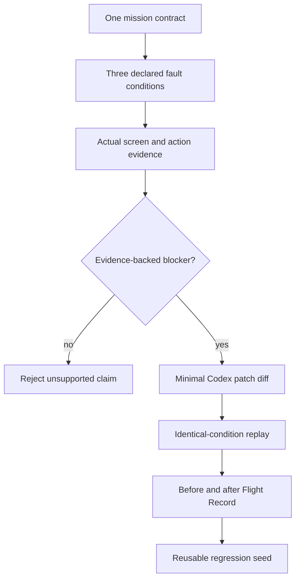

# PersonaFlight Replay Court - Plan

## Goal Capsule

- **Objective:** 출시 전 모바일 웹 미션의 실패를 실제 행동 근거로 발견하고, 하나의 코드 수정 후 동일 조건 재실행으로 개선을 증명한다.
- **Product authority:** 이 문서가 Replay Court MVP의 사용자 행동, 범위, 성공 기준을 결정한다.
- **Open blockers:** 없음. 임의 URL 지원과 live code mutation은 MVP 이후로 미룬다.

---

## Product Contract

### Summary

PersonaFlight Replay Court는 한 개의 준비된 앱 미션을 세 가지 공개된 UX 스트레스 조건으로 실행한다.
제품은 실패 근거, 수정 diff, 동일 조건 재실행 결과를 하나의 Flight Record로 묶어 출시 전 회귀 자산으로 남긴다.

### Problem Frame

1인 바이브코더는 앱을 빠르게 출시할 수 있지만 본인의 사용 방식에 익숙해져 초보자, 모바일 입력, 낮은 인내심에서 발생하는 UX 결함을 놓친다.
일반 AI UX 평가는 그럴듯한 의견을 만들 수 있으나 행동 증거와 수정 후 재검증이 없으면 자동화 편향을 강화한다.
Synthetic persona는 인간을 정확히 예측하지 못하므로 MVP는 인구통계적 대표성 대신 재현 가능한 스트레스 조건을 사용한다.

### Key Decisions

- **Replay over report:** 핵심 산출물은 긴 AI 리포트가 아니라 같은 조건에서의 수정 전 실패와 수정 후 성공 비교다.
- **Fault conditions over demographic prediction:** 연령·성별로 능력을 단정하지 않고 patience, input, inference 같은 관찰 가능한 제약을 공개한다.
- **Evidence authority:** AI 설명보다 screenshot, action trace, 성공 조건 판정, 코드 diff가 우선한다.
- **Deterministic demo first:** API key 없이 완주하는 준비된 demo case를 제품의 기본 경로로 삼는다.
- **Human approval boundary:** 수정안은 명시적으로 보여주며 사용자의 승인 없이 외부 저장소를 변경하지 않는다.

### Actors

- A1. **Solo builder:** 핵심 미션과 성공 기준을 확인하고 Flight Record로 출시 판단을 내린다.
- A2. **Fault-condition runner:** 공개된 제약에 따라 동일한 미션을 수행하고 행동 증거를 남긴다.
- A3. **Codex reviewer:** 실패 근거를 코드 위치와 연결하고 최소 수정 diff를 제안한다.
- A4. **Evidence reviewer:** 근거가 없는 주장과 수정 후에도 재현되는 실패를 통과시키지 않는다.

### Requirements

**Mission and conditions**

- R1. MVP는 의도적 결함이 포함된 모바일 웹앱 하나와 출시를 좌우하는 미션 하나를 제공해야 한다.
- R2. 미션은 시작 상태, 성공 조건, 실패 조건이 명시되어 동일하게 재실행되어야 한다.
- R3. 패널은 정확히 세 가지 fault condition을 사용하며 각 조건의 행동 제약을 사용자에게 공개해야 한다.
- R4. 인구통계 정보는 장식이나 행동 예측 근거로 사용하지 않아야 한다.

**Evidence and verdict**

- R5. 각 실행은 실제 앱 화면, 시간순 행동, 최종 성공 여부를 증거로 남겨야 한다.
- R6. 모든 발견은 하나 이상의 실행 증거 ID를 인용해야 하며 근거가 없는 AI 주장은 기각되어야 한다.
- R7. 수정 전 Flight Record는 조건별 첫 실패 지점과 공통 blocker를 한 화면에서 비교해야 한다.

**Repair and replay**

- R8. 제품은 blocker 하나와 연결된 최소 코드 diff를 보여줘야 한다.
- R9. 수정 후 실행은 수정 전과 같은 조건, 시작 상태, 미션, 성공 기준을 사용해야 한다.
- R10. 최종 판결은 전후 결과와 미해결 실패를 숨기지 않고 표시해야 한다.
- R11. 완료된 사례는 미션, 조건, 증거, diff, 전후 판정을 포함한 regression seed로 내보낼 수 있어야 한다.

**Trust and demo**

- R12. 기본 demo mode는 외부 API key와 계정 없이 90초 안에 완주해야 한다.
- R13. 제품은 synthetic condition 결과가 실제 사용자 리서치나 시장 검증을 대체하지 않는다고 명시해야 한다.
- R14. 실행 중인 Plan, Parallel, Review, Integrate 단계를 화면과 Build Log에서 실제 증거로 보여줘야 한다.

### Key Flows

- F1. **Preflight contract**
  - **Trigger:** Solo builder가 demo case를 시작한다.
  - **Actors:** A1, A2
  - **Steps:** 미션, 성공 기준, 세 fault condition, 안전 경계를 확인하고 실행한다.
  - **Outcome:** 세 실행이 같은 계약을 공유한다.
  - **Covered by:** R1, R2, R3, R12
- F2. **Parallel failure hearing**
  - **Trigger:** Preflight contract가 확정된다.
  - **Actors:** A2, A4
  - **Steps:** 세 조건이 미션을 실행하고 screenshot과 action evidence를 남기며 Evidence Reviewer가 blocker를 확정한다.
  - **Outcome:** 조건별 실패와 공통 blocker가 보이는 수정 전 Flight Record가 생성된다.
  - **Covered by:** R5, R6, R7
- F3. **Patch and identical replay**
  - **Trigger:** 공통 blocker가 확정된다.
  - **Actors:** A1, A3, A4
  - **Steps:** 최소 diff를 검토하고 준비된 수정 버전에 같은 계약을 재실행한다.
  - **Outcome:** 수정 전후 판결과 regression seed가 생성된다.
  - **Covered by:** R8, R9, R10, R11

### Acceptance Examples

- AE1. **Covers R5, R7.** Given the touch-only condition cannot reach the primary CTA, when the run ends, then its screenshot, attempted action, failing element, and failure verdict appear together.
- AE2. **Covers R6.** Given an AI finding cites an unknown evidence ID, when Evidence Reviewer runs, then the finding is rejected and omitted from the accepted issue list.
- AE3. **Covers R9, R10.** Given the same three conditions run on the fixed version, when one condition still fails, then the final verdict remains partially blocked rather than showing a fabricated full pass.
- AE4. **Covers R12.** Given no OpenAI API key is configured, when a judge starts the demo, then the entire prepared case reaches the final Flight Record within 90 seconds.

### Success Criteria

- A judge can explain the product as “같은 조건으로 실패를 고치고 다시 증명하는 출시 전 UX 회귀 테스트” after a 20-second silent clip.
- The prepared flawed case produces at least one evidence-backed blocker and the fixed case improves the declared completion result.
- Desktop and mobile product UI complete the demo flow without credentials.
- The Build Log maps real commits and test outputs to Plan, Parallel, Review, Integrate without fabricated activity.

### Scope Boundaries

**Deferred for later**

- Safe preview URLs and localhost projects beyond the bundled demo case.
- More fault conditions, authenticated flows, and continuous regression history.
- Live Codex patch application after explicit repository authorization.

**Outside this product's identity**

- Native iOS or Android automation in this MVP.
- Statistical claims about population behavior or persona-based market validation.
- Demographic stereotypes, autonomous destructive actions, or automatic merge and deployment.
- Replacing moderated human usability research.

### Dependencies and Assumptions

- The bundled flawed and fixed app versions are treated as a transparent deterministic demo fixture.
- Browser automation may fail independently of product UX; infrastructure failure must be distinguished from mission failure.
- A three-condition panel demonstrates mechanism diversity but not statistical representativeness.

### Sources and Research

- `docs/superpowers/plans/2026-08-16-personaflight-mvp.md`
- `src/lib/domain/persona-generator.ts`
- `src/lib/runner/safety-policy.ts`
- AgentUX and Marketrix establish that persona-driven browser testing already has prior art; Replay Court differentiates on evidence-to-fix-to-identical-rerun.
- ACM research on synthetic-user evaluation supports positioning synthetic runs as heuristic evidence rather than human prediction.
