# Codex Conversation Log — 2026-08-16

This is an unabridged export of the user and Codex conversation for hackathon review. Platform-injected system/developer/environment messages are excluded because they are not participant conversation. User-provided image attachments are retained in `assets/`.

## 1. User

?롢뀋

## 2. Codex

?롢뀋! 臾댁뾿??媛숈씠 ?대낵源?

## 3. User

?덊룷吏€?좊━ ?대줎?댁삤?ㅻ㈃ ?쇰떒 ?대뜑瑜?留뚮뱾?댁빞?섏??

## 4. Codex

瑗?? ?꾨땲?? `git clone`???€???대뜑瑜??먮룞?쇰줈 留뚮뱾?댁쨾.

```powershell
git clone https://github.com/?ъ슜?먮챸/?덊룷紐?git
```

洹몃윭硫??꾩옱 ?꾩튂??`?덊룷紐? ?대뜑媛€ ?앷꺼. ?대뜑 ?대쫫??吏곸젒 ?뺥븯?ㅻ㈃:

```powershell
git clone https://github.com/?ъ슜?먮챸/?덊룷紐?git ?닿??뺥븳?대뜑紐?n```

?대? 留뚮뱺 鍮??대뜑 ?덉뿉 ?댁슜??諛붾줈 諛쏄퀬 ?띕떎硫?洹??대뜑濡??대룞????

```powershell
git clone https://github.com/?ъ슜?먮챸/?덊룷紐?git .
```

## 5. User

洹몃읆 洹몃깷 諛뷀깢?붾㈃???댁쨾

## 6. Codex

媛€?ν빐. ?대줎???덊룷吏€?좊━ 二쇱냼(URL)瑜?蹂대궡以? 諛뷀깢?붾㈃???대뜑瑜?留뚮뱾?댁꽌 諛쏆븘?섍쾶.

## 7. User

??蹂듬텤???덈릺吏€ 而쮟媛€?덈뤌

## 8. Codex

媛€???곕???李쎌뿉??`Ctrl+V`媛€ ??癒뱀쓣 ???덉뼱. PowerShell?먯꽌??蹂댄넻 ?ㅼ쓬 以??섎굹媛€ ??

- ?곕???李쎌뿉??留덉슦???ㅻⅨ履??대┃
- `Ctrl + Shift + V`
- 李??쇱そ ???꾩씠肄??대┃ ???몄쭛 ??遺숈뿬?ｊ린

?덊룷 二쇱냼瑜??ш린 梨꾪똿??洹몃깷 遺숈뿬??愿쒖갖?? `https://github.com/...` ?뺥깭硫???

## 9. User

[https://github.com/sunnn62/Codex-Hackaton-02.git](https://github.com/sunnn62/Codex-Hackaton-02.git)

## 10. Codex

諛뷀깢?붾㈃??`Codex-Hackaton-02` ?대뜑濡??대줎?좉쾶.

## 11. Codex

?대줎 ?꾨즺?덉뼱. 諛뷀깢?붾㈃??[Codex-Hackaton-02](</C:\Users\sunnn\OneDrive\Desktop\Codex-Hackaton-02>) ?대뜑???덉뼱.

## 12. User

?덊룷?대쫫?대뻹? 2?€?대씪 ?€?뉕쾶 ??n

## 13. Codex

愿쒖갖?? `Codex-Hackaton-02`硫?Codex ?댁빱??2?€?대씪???살씠 諛붾줈 蹂댁뿬???ㅼ슜?곸씠??

?ㅻ쭔 泥좎옄??蹂댄넻 `Hackathon`?대씪?? ???먯뿰?ㅻ읇寃??섎젮硫?`Codex-Hackathon-Team-02` ?뺣룄媛€ 醫뗭븘. 吏€湲??대쫫??異⑸텇???뚯븘蹂????덉쑝??援녹씠 諛붽? ?꾩슂???놁뼱.

## 14. User

?쇰떒 ?꾨줈?앺듃 湲곕낯 ?명똿?대굹 釉뚮옖移?洹쒖튃?대굹 ?대윴嫄??뺣━?대낫??n

## 15. Codex

?꾩옱 ?덊룷 援ъ“?€ 湲곗〈 ?ㅼ젙??癒쇱? ?뺤씤???? ?€ ?묒뾽??諛붾줈 ?????덈뒗 湲곕낯 ?명똿쨌釉뚮옖移?洹쒖튃?쇰줈 ?뺣━?좉쾶.

## 16. Codex

?꾩옱??README留??덈뒗 鍮??덊룷?? 癒쇱? ?꾨옒 湲곗??쇰줈 ?쒖옉?섎㈃ 源붾걫??

- 湲곕낯 釉뚮옖移? `main` ????긽 ?ㅽ뻾 媛€?ν븳 ?덉젙 踰꾩쟾留?n- ?묒뾽 釉뚮옖移? `feat/湲곕뒫紐?, `fix/?섏젙紐?, `docs/臾몄꽌紐?
  - ?? `feat/login-page`, `feat/landing-ui`, `fix/header-layout`
- ?묒뾽 ?먮쫫: `main` 理쒖떊?????묒뾽 釉뚮옖移??앹꽦 ???묒뾽 ??PR ???€??1紐??뺤씤 ??`main` 蹂묓빀
- 而ㅻ컠: `feat: 濡쒓렇???붾㈃ 異붽?`, `fix: 紐⑤컮??硫붾돱 ?ㅻ쪟 ?섏젙`, `docs: 釉뚮옖移?洹쒖튃 異붽?`
- 吏곸젒 `main`???몄떆?섏? ?딄린

湲곕낯 ?뚯씪?€ ?대윴 援ъ꽦??醫뗭븘:

```text
README.md        # ?꾨줈?앺듃 ?뚭컻쨌?ㅽ뻾 諛⑸쾿쨌?€??nCONTRIBUTING.md  # 釉뚮옖移?而ㅻ컠/PR 洹쒖튃
.env.example     # ?섍꼍蹂€???덉떆 (?ㅼ젣 ?ㅻ뒗 ?덈? ?щ━吏€ ?딄린)
.gitignore
```

?꾨줈?앺듃媛€ ?뱀빋?몄?, ?깆씤吏€, ?먮뒗 ?대뼡 湲곗닠?????덉젙?몄? ?뚮젮以? ?덈? ?ㅼ뼱 `Next.js + TypeScript + Tailwind`泥섎읆 留먰빐二쇰㈃, 洹??ㅽ깮??留욎떠 珥덇린 ?명똿怨???臾몄꽌?ㅼ쓣 ?ㅼ젣濡?留뚮뱾?댁쨪寃?

## 17. User

codex plan?€ ?대뼸寃??곕뒗嫄곗??

## 18. Codex

Codex??怨꾪쉷 湲곕뒫 ?ъ슜踰뺤쓣 臾삳뒗 嫄곕씪, 理쒖떊 怨듭떇 ?덈궡瑜??뺤씤?댁꽌 ?ㅻ챸?좉쾶.

## 19. User

# Context from my IDE setup:

## Active file: README.md

## Open tabs:
- README.md: README.md

## My request:
?뉎뀋?ㅻ챸?댁쨾

## 20. Codex

`Plan`?€ 諛붾줈 肄붾뱶瑜??섏젙?섍쾶 ?섏? ?딄퀬, 癒쇱? ?묒뾽 ?쒖꽌?€ ?곹뼢 踰붿쐞瑜??ㅺ퀎?섍쾶 ?섎뒗 紐⑤뱶??

?ъ슜 ?쒖꽌??蹂댄넻 ?대옒:

1. 梨꾪똿 ?낅젰李?洹쇱쿂??紐⑤뱶瑜?`Plan`?쇰줈 諛붽씔??
2. ?먰븯???쇱쓣 援ъ껜?곸쑝濡??붿껌?쒕떎.
3. Codex媛€ ?덊룷瑜??댄렣蹂닿퀬 怨꾪쉷???쒖븞?쒕떎.
4. 怨꾪쉷???뺤씤?섍퀬 ?섏젙 ?섍껄??以€??
5. 愿쒖갖?쇰㈃ ?쒖씠 怨꾪쉷?€濡?援ы쁽?댁쨾?앸씪怨??댁꽌 ?ㅽ뻾?쇰줈 ?꾪솚?쒕떎.

?덈? ?ㅼ뼱 吏€湲??꾨줈?앺듃?먯꽌???대젃寃??낅젰?섎㈃ 醫뗭븘:

```text
???덊룷??React + TypeScript + Vite 湲곕컲?????꾨줈?앺듃瑜??명똿?섎젮怨???
?꾩쭅 ?뚯씪?€ ?섏젙?섏? 留먭퀬, ?꾩슂???⑦궎吏€?€ ?대뜑 援ъ“,
釉뚮옖移??꾨왂, 珥덇린 援ы쁽 ?쒖꽌瑜??④퀎蹂?怨꾪쉷?쇰줈 ?묒꽦?댁쨾.
```

怨꾪쉷??諛쏆? ?ㅼ뿉??

```text
3踰??④퀎??Tailwind???쒖쇅?섍퀬, ?섎㉧吏€????怨꾪쉷?€濡?援ы쁽?댁쨾.
```

?대윴 ?앹쑝濡??댁뼱媛€硫???

?듭떖?€ `Plan`?먯꽌 ?붽뎄?ы빆怨?諛⑺뼢???뺤젙?섍퀬, ?ㅼ젣 ?뚯씪 ?앹꽦쨌?섏젙?€ ?뱀씤????吏꾪뻾?섎뒗 嫄곗빞. ?댁빱?ㅼ쿂??珥덈컲 ?ㅺ퀎媛€ 以묒슂???묒뾽???뱁엳 ??留욎븘. 怨듭떇 Codex 媛€?대뱶??蹂듭옟???묒뾽?먯꽌 癒쇱? 怨꾪쉷???몄슫 ??援ы쁽쨌寃€利앺븯???먮쫫???덉떆濡??좊떎. [OpenAI Codex use cases](https://developers.openai.com/codex/use-cases)

## 21. User

# Context from my IDE setup:

## Active file: README.md

## Open tabs:
- README.md: README.md

## My request:
??吏€湲????뚯씪 援ъ“瑜?蹂닿퀬?덈굹? 諛뷀깢?붾㈃???대줎?댁삩嫄닿??
洹몃━怨??ㅻ뒛 ?댁빱?ㅼ쓣 ?섎뒗????plan湲곕뒫???곕뒗寃?醫뗭쓣源? 
4?명??쇰줈 援ъ꽦?섏뼱??湲곕낯 ?명똿怨?洹쒖튃???뺥빐?볤퀬 ?쒖옉?섎㈃ ??嫄곌컳??n

## 22. Codex

?? ?꾩옱 ?묒뾽 ?꾩튂?€ ?덊룷 ?곹깭???뺤씤?대몦 ?곹깭?? ?댁빱?ㅼ뿉??Plan???대뼸寃??욎뼱 ?곕㈃ 醫뗭?吏€???€ 洹쒕え??留욎떠 ?뺣━?대낵寃?

## 23. Codex

?? ?섎뒗 ?꾩옱 ???덊룷???뚯씪???쎄퀬 ?뺤씤?????덉뼱. ?ㅼ젣濡??뺤씤???곹깭??

- ?꾩튂: `諛뷀깢?붾㈃/Codex-Hackaton-02`
- 釉뚮옖移? `main`
- ?꾩옱 ?뚯씪: `README.md` ?섎굹
- ?먭꺽 ?€?μ냼: `sunnn62/Codex-Hackaton-02`

IDE ?붾㈃ ?먯껜瑜??ㅼ떆媛꾩쑝濡?蹂대뒗 嫄??꾨땲吏€留? ?ㅺ? ?댁뼱 ??`README.md`??媛숈? ?대줎 ?덊룷 ?덉쓽 ?뚯씪?댁빞.

?ㅻ뒛 ?댁빱?ㅼ씠?쇰㈃ Plan 湲곕뒫?€ **珥덈컲 15~20遺꾩뿉留??곴레 異붿쿇**?? ?꾩씠?붿뼱?€ 湲곗닠 ?좏깮???뺣━?섍린 ?꾩뿉 ?곕㈃ ?€??媛??댁꽍 李⑥씠瑜?以꾩뿬以? 諛섎?濡??붾㈃ 臾멸뎄 ?섎굹 ?섏젙 媛숈? ?묒? ?묒뾽留덈떎 Plan???곕㈃ ?먮젮??

4???€?대㈃ ?대젃寃??쒖옉?섎뒗 寃?醫뗭븘:

1. 紐⑤몢 ?④퍡 Plan?쇰줈 ?쒖꽌鍮꾩뒪 ?듭떖 湲곕뒫, ?섏씠吏€ 紐⑸줉, ?곗씠?? 湲곗닠 ?ㅽ깮, ??븷 遺꾨같?앸? ???μ쭨由?怨꾪쉷?쇰줈 ?뺤젙
2. `main`?먮뒗 吏곸젒 ?묒뾽?섏? ?딄퀬, 媛곸옄 湲곕뒫 釉뚮옖移??앹꽦
3. ??紐낆? ?꾨줈?앺듃 珥덇린 ?명똿 ?대떦, ?섎㉧吏€ ?뗭? 異⑸룎???곸? 湲곕뒫 ?⑥쐞濡??섎닎
4. 湲곕뒫???앸궇 ?뚮쭏??PR???щ━怨? ?ㅻⅨ ??紐낆씠 鍮좊Ⅴ寃??뺤씤 ??蹂묓빀

珥덇린 Plan ?꾨＼?꾪듃???대?濡??⑤룄 ??

```text
?곕━??4???댁빱???€?대떎.
[留뚮뱾 ?쒕퉬????以??ㅻ챸]???ㅻ뒛 ?덉뿉 援ы쁽?댁빞 ?쒕떎.

?뚯씪?€ ?꾩쭅 ?섏젙?섏? 留먭퀬,
MVP ?듭떖 湲곕뒫 3~5媛? ?꾩슂???섏씠吏€, 異붿쿇 湲곗닠 ?ㅽ깮,
4紐???븷 遺꾨떞, ?대뜑 援ъ“, 媛쒕컻 ?쒖꽌瑜?n?댁빱???쒓컙 ?쒖빟??怨좊젮?댁꽌 媛꾧껐??怨꾪쉷?쇰줈 ?묒꽦?댁쨾.
```

洹몃떎???⑹쓽?섎㈃:

```text
??怨꾪쉷??湲곗??쇰줈 ?꾨줈?앺듃 湲곕낯 ?명똿??吏꾪뻾?댁쨾.
README, .gitignore, CONTRIBUTING.md??釉뚮옖移샕룹빱諛떷텾R 洹쒖튃??異붽??댁쨾.
```

怨듭떇 Codex 媛€?대뱶??蹂듭옟??援ы쁽 ??怨꾪쉷???몄썙 ?묒뾽 ?먮쫫???뺥븯??諛⑹떇???쒖슜 ?щ?濡??쒖떆?? [OpenAI Codex use cases](https://developers.openai.com/codex/use-cases)

?쒕퉬???꾩씠?붿뼱瑜???以꾨줈 ?뚮젮二쇰㈃, 4????븷 遺꾨떞源뚯? 諛붾줈 媛숈씠 Plan?쇰줈 ?≪븘以꾧쾶.

## 24. User

# Context from my IDE setup:

## Active file: README.md

## Open tabs:
- README.md: README.md

## My request:
## ?ㅻ뒛 媛€???ш쾶 蹂대뒗 ??媛€吏€

1. 臾몄젣?€ 李⑤퀎??
    1. 臾댁뾿???덈∼寃??앷컖?덈뒗媛€? 
2. ?묐룞?섎뒗 ?쒗뭹
    1. ?듭떖 ?먮쫫???ㅼ젣濡??묐룞?섎뒗媛€?
3. GPT - Codex Build Orchestration
    1. aI?€ ?④퍡 ?대뼸寃?留뚮뱾?덈뒗媛€? 
4. ?ъ슜??媛€移?寃쏀뿕, ?€ ?묒뾽 ?듯빀 

### AI ?ъ슜?됱씠 ?꾨땲???④퍡 ?쇳븳 諛⑹떇??蹂댁뿬二쇱꽭??r

- plan: 臾댁뾿???щ엺怨?AI?먭쾶 留↔꼈?붽?
- parallel: ??紐낆쓽 ?묒뾽???대뼸寃?蹂묐젹?뷀뻽?붽?
- review: 寃곌낵瑜??대뼸寃?寃€?좏븯怨?怨좎낀?붽?
- integrate: 媛곸옄???묒뾽???대뼸寃??섎굹濡??⑹낀?붽?


?닿쾶 ?덉뿀怨?n
泥섏쓬???뚭컻?댁＜??湲곗닠?ㅼ? 洹몃깷 ?덉뜥?꾨릺?붾뜲 ?뚭컻?댁?嫄곌릿?쒕뜲 ?몃쭔?쒓쾶?덈뒗吏€ ?뚮젮以?n- **odex Plan ???곴레 ?쒖슜 異붿쿇**
    - ?꾩씠?붿뼱 ?뺣━
    - ?붽뎄?ы빆 ?뺣━
    - ?꾨줈?앺듃 援ъ“ ?ㅺ퀎
    - 援ы쁽 ?쒖꽌 寃곗젙
    - ?ㅻ뒛 ?섎（??媛쒕컻 怨꾪쉷 ?섎┰
    - **媛€??癒쇱? ?⑤낵 寃?*
- **MCP ???꾩슂??寃쎌슦 ?쒖슜**
    - ?몃? ?쒕퉬??API/DB ?깆쓣 Codex媛€ 吏곸젒 ?ㅻ쨪???????좎슜
    - ?? GitHub, DB, ?뱀젙 API ?깆쓣 ?먯씠?꾪듃媛€ 吏곸젒 議곗옉
    - **?꾩슂?댁쭏 ??異붽?**?섎㈃ ??
- **Harness ???곹솴 遊먯꽌**
    - Codex媛€ 諛섎났?곸쑝濡?援ы쁽 ???뚯뒪?????섏젙?섎룄濡??묒뾽 ?섍꼍/洹쒖튃???〓뒗 ?먮굦
    - ?꾨줈?앺듃媛€ 而ㅼ?硫?醫뗭?留?**?ㅻ뒛?€ 援녹씠 源딄쾶 ?뚯? ?딆븘????**
- **Toolkit ???덉쑝硫??쒖슜**
    - ?됱궗?먯꽌 ?쒓났?섎뒗 ?쒗뵆由??꾧뎄 紐⑥쓬?대씪硫?**珥덇린 ?명똿 ?쒓컙??以꾩씠???⑸룄濡?* ?ъ슜.
    - ?€???대뼡 ?ㅽ깮???좏깮?덈뒗吏€ 蹂닿퀬 寃곗젙.
- **AIDLC ??李멸퀬??*
    - ?붽뎄?ы빆 ???ㅺ퀎 ??援ы쁽 ???뚯뒪??媛숈? **媛쒕컻 ?꾨줈?몄뒪 ?먯껜瑜?泥닿퀎??*?섎뒗 ???꾩?.
- ?ㅻ뒛?€ ?닿구 ?꾧꺽?섍쾶 ?곸슜?섍린蹂대떎 **Plan ?④퀎?먯꽌 李멸퀬**?섎뒗 ?뺣룄媛€ 醫뗭쓬.

## 25. Codex

?ㅻ뒛 ?됯? 湲곗???蹂대㈃, 湲곗닠??留롮씠 ?곕뒗 寃껊낫??**Codex?€ ?€???섎룄?곸쑝濡??묒뾽???붿쟻**??蹂댁뿬二쇰뒗 寃??듭떖?댁빞. ?곗꽑?쒖쐞???대젃寃?異붿쿇??

| ?꾧뎄/諛⑹떇 | ?ㅻ뒛 異붿쿇 | ?댁쑀 |
|---|---:|---|
| Codex Plan | ?곴레 ?ъ슜 | ?됯? ??ぉ??`plan`??媛€??吏곸젒?곸쑝濡?利앸챸 |
| Parallel | ?곴레 ?ъ슜 | 4???€ 媛뺤젏??蹂댁뿬以?|
| Review / Integrate | ?곴레 ?ъ슜 | PR쨌由щ럭쨌蹂묓빀 湲곕줉???⑥쓬 |
| MCP | ?꾩슂???뚮쭔 | DB쨌GitHub ?깆쓣 Codex媛€ 吏곸젒 留뚯졇?????뚮쭔 |
| Toolkit | 癒쇱? ?뺤씤 | ?쒗뵆由우씠 ?덉쑝硫?珥덇린 ?명똿 ?쒓컙???ш쾶 ?덉빟 |
| Harness | 援녹씠 源딄쾶 X | ?섎（吏쒕━ ?댁빱?ㅼ뿉???ㅼ젙 鍮꾩슜?????????덉쓬 |
| AIDLC | 泥댄겕由ъ뒪?몃줈留?| 蹂꾨룄 ?꾧뎄泥섎읆 ?꾧꺽???곸슜???꾩슂 ?놁쓬 |

媛€??醫뗭? ?댁쁺 諛⑹떇?€ ?닿굅??

```text
Plan: ?꾩썝??MVP쨌??븷쨌援ъ“瑜?Codex?€ ?④퍡 ?뺤젙
Parallel: 4紐낆씠 ?쒕줈 ?ㅻⅨ 湲곕뒫 釉뚮옖移섏뿉??蹂묐젹 援ы쁽
Review: ?쒕줈 PR ?섎굹 ?댁긽 由щ럭
Integrate: main???⑹튂怨??듭떖 ?ъ슜???먮쫫??媛숈씠 ?뚯뒪??n```

MCP??吏€湲??뱀옣 ?꾩슂?섏? ?딆븘 蹂댁뿬. GitHub ?곕룞, Supabase 媛숈? DB ?곌껐, ?몃? API ?ㅼ젙??Codex媛€ 吏곸젒 ?ㅻ쨪?????뚮쭔 異붽??섎㈃ ?? ?⑥닚???뱀빋??留뚮뱾怨?Git?쇰줈 ?묒뾽?섎뒗 ?곕뒗 ?놁뼱??異⑸텇??

Toolkit?€ ?됱궗 痢≪씠 以€ 寃??덈떎硫?**??10遺꾨쭔 ?뺤씤**?대킄. ?몄쬆, 諛고룷, UI ?쒗뵆由? DB 媛숈? 嫄?諛붾줈 ?쒓났?쒕떎硫??곌퀬, ?꾨땲硫???꽑 ?꾧뎄 ?숈뒿???쒓컙???곗? ?딅뒗 寃?醫뗭븘.

洹몃━怨?寃곌낵臾쇱뿉 ?꾨옒 湲곕줉???④린硫??쏛I?€ ?대뼸寃??쇳뻽?붽??앸? 諛쒗몴?먯꽌 蹂댁뿬二쇨린 ?명빐:

```text
docs/
  PLAN.md          # Codex?€ ?뺥븳 MVP, ??븷, 援ы쁽 ?쒖꽌
  DECISIONS.md     # 湲곗닠 ?좏깮怨??댁쑀
  REVIEW.md        # ?뚯뒪?맞룸━酉곗뿉??諛쒓껄?섍퀬 怨좎튇 ?댁슜
```

README?먮뒗 ?쏞odex ?묒뾽 諛⑹떇???뱀뀡??吏㏐쾶 ?ｌ쑝硫??? ?? ?쏱lan?쇰줈 MVP瑜??뺥븯怨? 湲곕뒫 ?⑥쐞 釉뚮옖移섏뿉??蹂묐젹 援ы쁽?덉쑝硫? PR 由щ럭 ??main???듯빀?덈떎.??n
寃곕줎?곸쑝濡??ㅻ뒛?€ **Plan + 4媛?湲곕뒫 釉뚮옖移?+ PR 由щ럭 + ?듯빀 湲곕줉**??吏묒쨷?섏옄. 洹멸쾶 ?됯? 湲곗?怨?媛€???뺥솗??留욎븘.

## 26. User

# Context from my IDE setup:

## Active file: README.md

## Open tabs:
- README.md: README.md

## My request:
?댁뒋??釉뚮젋移??꾨왂 md媛숈?嫄??묒꽦?댁빞?섎젮??? ?덊빐???섎젮??n

## 27. Codex

?묒꽦?섎뒗 嫄?異붿쿇?? ?ㅻ쭔 臾몄꽌瑜?留롮씠 履쇨컻湲곕낫?? ?ㅻ뒛?€ `README.md`??吏㏐쾶 ?ｊ굅??`docs/WORKFLOW.md` ?섎굹留?留뚮뱾硫?異⑸텇??

?뱁엳 ?됯??먯꽌 ?묒뾽 諛⑹떇??蹂몃떎怨??덉쑝?? 洹쒖튃 ?먯껜蹂대떎 ?쒖슦由ш? ?대젃寃??⑹쓽?섍퀬 ?댁쁺?덈떎?앸뒗 利앷굅媛€ ?⑤뒗 寃?醫뗭븘.

理쒖냼 洹쒖튃?€ ???뺣룄硫???

```md
## ?묒뾽 洹쒖튃

- `main`: ?곕え 媛€?ν븳 ?덉젙 踰꾩쟾留??좎??쒕떎.
- ?묒뾽 ???댁뒋瑜?留뚮뱾怨? ?댁뒋 踰덊샇瑜?遺숈뿬 釉뚮옖移섎? ?앹꽦?쒕떎.
- 釉뚮옖移? `feat/#?댁뒋踰덊샇-湲곕뒫紐?, `fix/#?댁뒋踰덊샇-?섏젙紐?
- ?? `feat/#3-login`
- 而ㅻ컠: `feat: 濡쒓렇???붾㈃ 援ы쁽 (#3)`
- ?묒뾽 ?꾨즺 ??PR??留뚮뱾怨? ?€??1紐??댁긽???뺤씤????蹂묓빀?쒕떎.
- `main`?먮뒗 吏곸젒 push?섏? ?딅뒗??
```

?댁뒋??蹂듭옟?섍쾶 ???꾩슂 ?놁뼱. 湲곕뒫????以꾩쭨由??댁뒋硫?異⑸텇??

```md
?쒕ぉ: 濡쒓렇???붾㈃ 援ы쁽
?꾨즺 議곌굔:
- ?대찓???낅젰 媛€??n- 濡쒓렇??踰꾪듉 ?숈옉
- 紐⑤컮???붾㈃ ?뺤씤
?대떦: ?€???대쫫
```

?? ?쒓컙???뺣쭚 珥됰컯?섎㈃ ?댁뒋瑜?紐⑤뱺 ?묒? ?묒뾽??留뚮뱾 ?꾩슂???놁뼱. **?듭떖 湲곕뒫 3~5媛쒕쭔 ?댁뒋濡?留뚮뱾怨?*, 媛??댁뒋留덈떎 釉뚮옖移섏? PR???곌껐?? 洹몃윭硫?`plan ??parallel ??review ??integrate`媛€ GitHub 湲곕줉?쇰줈 ?먯뿰?ㅻ읇寃?利앸챸??

## 28. User

# Context from my IDE setup:

## Active file: README.md

## Open tabs:
- README.md: README.md

## My request:
?묒뾽洹쒖튃 洹몃읆 留뚮뱾?댁꽌 ?몄떆瑜쇳븯?쇰뒗嫄닿??
?댁뒋??援녹씠 ?덈쭔?ㅼ뼱???섏? ?딆쑝?ㅻ굹

## 29. Codex

留욎븘. 吏€湲덉쿂??鍮??덊룷 ?④퀎?먯꽌???닿? ?묒뾽 洹쒖튃 臾몄꽌瑜?留뚮뱾怨? ?ㅺ? ?뺤씤?섎㈃ `main`??泥?而ㅻ컠?쇰줈 ?몄떆?대몢硫??? 洹??ㅻ??곕뒗 媛곸옄 湲곕뒫 釉뚮옖移섎? 留뚮뱾???묒뾽?섎㈃ ?섍퀬.

?댁뒋??**援녹씠 ??留뚮뱾?대룄 ??** ?ㅻ뒛?€ ?댁빱?ㅼ씠??GitHub ?댁뒋 愿€由ш퉴吏€ ?섎㈃ ?ㅽ엳??踰덇굅濡쒖슱 ???덉뼱. ?€??釉뚮옖移??대쫫??湲곕뒫 湲곗??쇰줈 紐낇솗???섎㈃ 異⑸텇??

```text
feat/login
feat/main-page
feat/api-integration
fix/mobile-layout
```

異붿쿇 ?먮쫫?€:

```text
吏€湲? main??README + ?묒뾽 洹쒖튃 ?몄떆
?댄썑: ?€?먮퀎 feat 釉뚮옖移??앹꽦 ???묒뾽 ??PR ??main 蹂묓빀
```

洹쒖튃?€ `README.md` ?덉뿉 ?ｌ뼱???섍퀬, ??源붾걫?섍쾶 ?섎젮硫?`docs/WORKFLOW.md`濡?遺꾨━?섎㈃ ?? ?먰븯硫??닿? 吏€湲?媛꾨떒???묒뾽 洹쒖튃 臾몄꽌瑜?留뚮뱾?댁꽌 泥?而ㅻ컠쨌?몄떆源뚯? ?댁쨪寃?

## 30. User

# Context from my IDE setup:

## Active file: README.md

## Open tabs:
- README.md: README.md

## My request:
源붾걫?섍쾶?좊옒

## 31. Codex

`docs/WORKFLOW.md`濡?遺꾨━?섍퀬, README?먯꽌 諛붾줈 李얠쓣 ???덇쾶 ?곌껐?좉쾶. ??珥덇린 洹쒖튃 臾몄꽌??`main`??泥?而ㅻ컠?쇰줈 ?щ┛ ?ㅻ???湲곕뒫 釉뚮옖移??묒뾽???쒖옉?섎㈃ ??

## 32. Codex

臾몄꽌 ?뚯씪??異붽??섎뒗 以묒씠?? ?꾨즺?섎㈃ ?댁슜 ?뺤씤 ??珥덇린 洹쒖튃 而ㅻ컠怨??몄떆源뚯? ?댁뼱媛덇쾶.

## 33. Codex

臾몄꽌 援ъ꽦???뺤씤?덇퀬, ?묒뾽 洹쒖튃?€ README?€ 遺꾨━??`docs/WORKFLOW.md`???뺣━?먯뼱. ?댁젣 ?????뚯씪留?珥덇린 而ㅻ컠?쇰줈 湲곕줉?좉쾶.

## 34. Codex

珥덇린 ?묒뾽 洹쒖튃 而ㅻ컠??留뚮뱾?덉뼱. ?먭꺽 `main`???몄떆?댁꽌 ?€?먮뱾??諛붾줈 諛쏆쓣 ???덇쾶 ?좉쾶.

## 35. Codex

源붾걫?섍쾶 遺꾨━?댁꽌 `main`???몄떆源뚯? ?꾨즺?덉뼱.

- ?묒뾽 洹쒖튃: [docs/WORKFLOW.md](</C:\Users\sunnn\OneDrive\Desktop\Codex-Hackaton-02\docs\WORKFLOW.md>)
- README ?덈궡 留곹겕: [README.md](</C:\Users\sunnn\OneDrive\Desktop\Codex-Hackaton-02\README.md>)
- 而ㅻ컠: `docs: add team workflow`

?댁젣 ?€?먮뱾?€ `git pull origin main` ????`feat/湲곕뒫紐? 釉뚮옖移섎? 留뚮뱾???쒖옉?섎㈃ ?? ?댁뒋???꾩닔媛€ ?꾨땲?꾨줉 洹쒖튃??紐낆떆?대???

## 36. User

# Context from my IDE setup:

## Active file: docs/PC3_REPLAY_GUIDE.md

## Open tabs:
- PC3_REPLAY_GUIDE.md: docs/PC3_REPLAY_GUIDE.md
- WORKFLOW.md: docs/WORKFLOW.md

## My request:
?꾩옱 ?뺥빐吏꾧굔 ?닿굅??md?뚯씪 ?€???щ┛嫄?李멸퀬?섎㈃ ??嫄곌컳??+ 洹몃━怨??닿? docs??md?뚯씪 ?섎굹 ?щ졇?붾뜲 ?닿쾶 ????븷?닿퀬 ?닿굔 源껎뿀釉뚯뿏 ?덉삱?ㅻ룄 ?섍쿋吏€? ?닿굅 蹂닿퀬 ?묒뾽?€ ?섎㈃ ??寃?媛숈븘

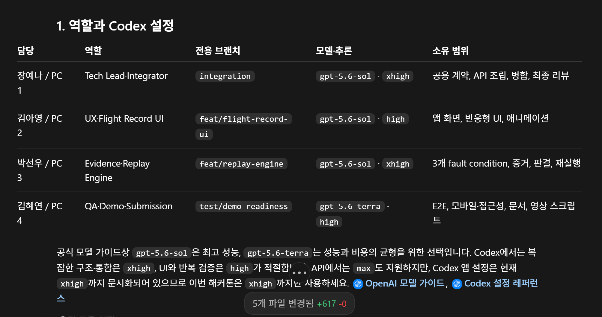

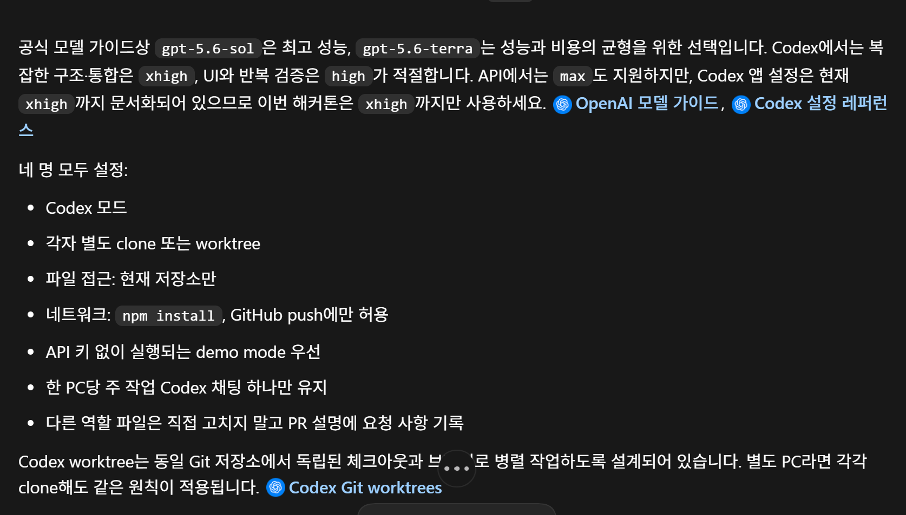

## 37. Codex

?щ┛ ??븷 媛€?대뱶媛€ ?€ 怨듭슜 臾몄꽌?몄? 媛쒖씤 ?묒뾽 硫붾え?몄? 援щ텇?댁꽌, GitHub???④만 寃껉낵 濡쒖뺄?먮쭔 ??寃껋쓣 ?뺣━?대낵寃?

## 38. Codex

?? `PC3_REPLAY_GUIDE.md`???꾩옱 GitHub?????щ씪媛?**濡쒖뺄 媛쒖씤 媛€?대뱶** ?곹깭?? 媛쒖씤 ??븷???묒뾽 吏€移⑥씠?쇰㈃ 援녹씠 ?몄떆?섏? ?딆븘????

?ㅻ쭔 `docs/` ?덉뿉 ?덉쑝???섏쨷???ㅼ닔濡?`git add .` ????媛숈씠 ?щ씪媛????덉뼱. ?욎쑝濡쒕뒗 媛€?대뱶???곹엺 ?€濡?蹂€寃쏀븳 ?뚯씪留?紐낆떆?댁꽌 `git add` ?섎㈃ ?? `git add .`留??쇳븯硫?愿쒖갖??

?묒뾽????臾몄꽌 湲곗??쇰줈 ?섎㈃ 異⑸텇?? ?덉쓽 踰붿쐞??紐낇솗??

- 釉뚮옖移? `feat/replay-engine`
- ?대떦: Evidence / Replay Engine
- ?듭떖: 3媛?fault condition, evidence ID 寃€利? before/after ?숈씪 議곌굔 ?ъ떎?? deterministic demo mode
- ?섏젙 湲덉?: 怨듭슜 怨꾩빟(`src/lib/contracts`), UI 而댄룷?뚰듃, 怨듭슜 ?ㅼ젙

?? **諛붾줈 援ы쁽???쒖옉?섍린 ?꾩뿉 PC1??怨듭슜 怨꾩빟怨?baseline SHA瑜?怨듭쑀쨌?몄떆?댁빞 ??** 洹?SHA瑜?湲곗??쇰줈 釉뚮옖移섎? 留뚮뱾?댁빞 PC1怨?異⑸룎 ?놁씠 遺숈씪 ???덉뼱.

```powershell
git fetch origin
git switch -c feat/replay-engine <PC1??怨듭쑀??BASELINE_SHA>
```

洹몃━怨?PC1?먭쾶 ?꾩슂??嫄??꾩껜 媛쒖씤 媛€?대뱶媛€ ?꾨땲?? `FlightRecord` ??怨듭슜 ?€?낆쓽 寃쎈줈쨌export 諛⑹떇쨌?섑뵆 ?곗씠???뺥깭留??꾨떖諛쏆쑝硫??? 洹몃떎????媛€?대뱶?€濡?TDD濡?吏꾪뻾?섎㈃ ?쒕떎.

## 39. User

# Context from my IDE setup:

## Active file: docs/WORKFLOW.md

## Open tabs:
- WORKFLOW.md: docs/WORKFLOW.md
- PC3_REPLAY_GUIDE.md: docs/PC3_REPLAY_GUIDE.md

## My request:
?꾨땲 諛쏆븘?붿뼱? ?€???щ┛嫄?n

## 40. Codex

?? ?€?먮뱾???щ┛ 蹂€寃쎌궗??쓣 ?대? 諛쏆븘???곹깭?몄? 臾삳뒗 嫄곌뎄?? ?먭꺽 ?€?μ냼瑜??덈줈 ?뺤씤?댁꽌 ?뺥솗??蹂쇨쾶.

## 41. Codex

?꾩쭅?€ 諛쏆븘?ㅼ? ?딆? ?곹깭?€?? ?뺤씤 寃곌낵 ?먭꺽 `main`???€?먯씠 ?щ┛ ??而ㅻ컠怨?`integration` 釉뚮옖移섍? ?덉뼱?? 癒쇱? `main`??理쒖떊?쇰줈 ?숆린?뷀븯怨??€ 臾몄꽌瑜??뺤씤?좉쾶.

## 42. Codex

?? 諛⑷툑 理쒖떊 蹂€寃쎌궗??쓣 諛쏆븘?붿뼱.

?€??GitHub `main`???щ┛ 嫄?[Agent.md](</C:\Users\sunnn\OneDrive\Desktop\Codex-Hackaton-02\Agent.md>)?닿퀬, ?쒗뭹 紐⑺몴쨌4????븷 遺꾨떞쨌怨듯넻 ?쒖빟???뺣━???덉뼱. `integration` 釉뚮옖移섎룄 ?앹꽦?먯?留??꾩옱 `main`怨?媛숈? ?곹깭??

?ㅻ쭔 [PC3_REPLAY_GUIDE.md](</C:\Users\sunnn\OneDrive\Desktop\Codex-Hackaton-02\docs\PC3_REPLAY_GUIDE.md>)??濡쒖뺄?먮뒗 ?덉?留??꾩쭅 GitHub `main`?먮뒗 ?녾퀬 `??`(異붿쟻 ???? ?곹깭?? 利? ?ㅺ? ?€?먯꽌 諛쏆븘??濡쒖뺄????媛쒖씤 ??븷 媛€?대뱶濡?蹂대㈃ ??

?댁젣 湲곗??€ 異⑸텇???뺥빐議뚭퀬, PC1??怨듭슜 contracts/API 堉덈?瑜??몄떆?섎㈃ 洹?而ㅻ컠??湲곗??쇰줈 `feat/replay-engine` 釉뚮옖移섎? ?곗꽌 ?쒖옉?섎㈃ ??

## 43. User

# Context from my IDE setup:

## Active file: docs/WORKFLOW.md

## Open tabs:
- WORKFLOW.md: docs/WORKFLOW.md
- PC3_REPLAY_GUIDE.md: docs/PC3_REPLAY_GUIDE.md

## My request:
?닿? 蹂대궦 ?ъ쭊?대옉 agent.md???닿? ?щ┛ pc3_guide.md ?닿굅 3媛????뺤씤?섍퀬 ?뺣━?댁꽌 留먰빐以??닿? ?댁빞 ???덉감瑜?n

## 44. Codex

?ъ쭊????븷?? 怨듭슜 `Agent.md`, 媛쒖씤 `PC3_REPLAY_GUIDE.md`瑜??쒕줈 ?€議고빐??PC3 ?묒뾽 ?덉감濡??뺣━?좉쾶. ?뱁엳 釉뚮옖移?湲곗?怨??뚯씪 ?뚯쑀 踰붿쐞媛€ 異⑸룎?섏? ?딄쾶 ?뺤씤?섍쿋??

## 45. Codex

???먮즺瑜???留욎떠蹂대㈃, ?덈뒗 PC3??**Evidence / Replay Engine** ?대떦?닿퀬, 吏€湲덉? 諛붾줈 肄붾뵫蹂대떎 **PC1??怨듭슜 baseline??湲곕떎由???遺꾨━ ?묒뾽**?섎뒗 ?쒖꽌媛€ 留욎븘.

以묒슂??湲곗??€ [Agent.md](</C:\Users\sunnn\OneDrive\Desktop\Codex-Hackaton-02\Agent.md>)媛€ 怨듭슜 ?붽뎄?ы빆, [PC3_REPLAY_GUIDE.md](</C:\Users\sunnn\OneDrive\Desktop\Codex-Hackaton-02\docs\PC3_REPLAY_GUIDE.md>)媛€ ??援ы쁽 吏€移? ?ъ쭊????븷쨌釉뚮옖移샕텰odex ?댁쁺 洹쒖튃?댁빞.

## ???묒뾽 ?덉감

1. 吏€湲덉? `main`?먯꽌 ?묒뾽?섏? ?딅뒗??n
- ?꾩옱 `main`怨?`integration`?먮뒗 ?꾩쭅 ??肄붾뱶쨌怨듭슜 contracts媛€ ?녿떎.
- PC1??`integration`??怨듭슜 ?€?? API/?쒕쾭 堉덈?, baseline SHA瑜??щ┫ ?뚭퉴吏€ 湲곕떎由곕떎.
- PC3 媛€?대뱶??`AGENTS.md`???ㅼ젣 ?뚯씪紐낃낵 ?ㅻⅤ?? Codex?먭쾶??**`Agent.md`瑜?癒쇱? ?쎌쑝??*怨??섎㈃ ?쒕떎.

2. PC1??baseline??怨듭쑀?섎㈃ 洹?而ㅻ컠?먯꽌 釉뚮옖移섎? 留뚮뱺??n
```powershell
git fetch origin
git switch -c feat/replay-engine <PC1??怨듭쑀??BASELINE_SHA>
git status
```

PR ?€?곸? `main`???꾨땲??`integration`?댁빞.

3. Codex ?ㅼ젙怨?泥??붿껌

?ъ쭊 湲곗??쇰줈 Codex 紐⑤뱶, `gpt-5.6-sol`, `xhigh`瑜??곌퀬, ??PC?먯꽌??二??묒뾽 梨꾪똿 ?섎굹留??좎??? 癒쇱? ?대젃寃??붿껌?섎㈃ ??

```text
Agent.md?€ docs/PC3_REPLAY_GUIDE.md瑜?癒쇱? ?쎌뼱以?
?섎뒗 PC3 Evidence / Replay Engine ?대떦?대ʼn ?꾩옱 釉뚮옖移섎뒗 feat/replay-engine?대떎.
?꾩쭅 援ы쁽?섏? 留먭퀬, PC1???쒓났??contracts瑜??뺤씤????n???뚯쑀 踰붿쐞?먯꽌 留뚮뱾 ?뚯씪, ?꾩슂??public exports, TDD 援ы쁽 ?쒖꽌瑜?5?④퀎濡??뺣━?댁쨾.
```

4. PC1?먭쾶 癒쇱? ?뺤씤??寃?n
- `FlightRecord`?€ evidence/finding 愿€???€?낆쓽 ?뺥솗??寃쎈줈
- ?꾩슂??public export 諛⑹떇
- PC2 UI媛€ PC3 ?곗씠?곕? ?붾㈃???쒖떆?섎뒗 諛⑹떇
- baseline SHA?€ PR ?€??釉뚮옖移?n
怨듭슜 `src/lib/contracts/**`??吏곸젒 怨좎튂吏€ 留먭퀬, 遺€議깊븳 ?꾨뱶媛€ ?덉쑝硫?PC1?먭쾶 ?붿껌??

5. 援ы쁽?€ ?뚯뒪?몃??? ???뚯쑀 踰붿쐞?먯꽌留??쒕떎

?섏젙 媛€??踰붿쐞:

```text
src/lib/replay/**
src/lib/evidence/**
replay 愿€??src/lib/domain/**
src/app/demo/**
tests/unit/replay-*.test.ts
tests/unit/evidence-*.test.ts
tests/unit/demo-flight.test.ts
```

?꾩닔 援ы쁽?€ ?ㅼ쓬?댁빞.

- 怨좎젙??3媛?fault condition ?ㅽ뻾
  - touch-only + small viewport
  - low patience + delayed feedback
  - reduced inference + ambiguous copy
- ?붾㈃쨌?됰룞쨌寃곌낵쨌evidence ID瑜?媛€吏?evidence ?앹꽦
- ?녿뒗 evidence ID瑜?李몄“?섎뒗 finding?€ 嫄곗젅
- ?숈씪 mission/?쒖옉 ?곹깭/?깃났 湲곗?/condition?쇰줈 before?€ after瑜??ъ떎??n- after?먯꽌 ?섎굹?쇰룄 ?ㅽ뙣?섎㈃ `full pass`媛€ ?꾨땲??`partial verdict`
- 釉뚮씪?곗?쨌?명봽???ㅽ뙣?€ UX ?ㅽ뙣瑜?援щ텇
- API ???놁씠, 媛숈? ?낅젰?대㈃ ??긽 媛숈? 寃곌낵媛€ ?섏삤??demo fixture
- regression seed ?앹꽦

6. PC3 媛€?대뱶??7媛??뚯뒪?몃? 癒쇱? RED濡?留뚮뱺??n
?뱁엳 ?꾨옒 ??媛쒕뒗 ?곕え ?됯???吏곸젒 蹂댁뿬二쇨린 醫뗭븘.

- before/after 議곌굔 ?쇱튂
- unknown evidence ID 嫄곗젅
- after ?ㅽ뙣 ??partial verdict
- regression seed JSON round-trip

7. 寃€利???紐낆떆?곸쑝濡?而ㅻ컠?쒕떎

```powershell
npm.cmd run test -- tests/unit/demo-flight.test.ts tests/unit/replay-contracts.test.ts
npm.cmd run test
git add src/lib/replay src/lib/evidence src/lib/domain src/app/demo tests/unit/demo-flight.test.ts tests/unit/replay-*.test.ts tests/unit/evidence-*.test.ts
git commit -m "feat: prove fixes with evidence-backed replay"
git push -u origin feat/replay-engine
```

`git add .`???곗? 留? 洹몃윭硫??꾩옱 濡쒖뺄 ?꾩슜??`docs/PC3_REPLAY_GUIDE.md`媛€ ?ㅼ닔濡?媛숈씠 ?щ씪媛????덉뼱.

8. `feat/replay-engine ??integration` Draft PR??留뚮뱾怨?PC1?먭쾶 ?꾨떖?쒕떎

PR?먮뒗 ?ㅼ쓬留?吏㏐쾶 ?곸쑝硫???

- 而ㅻ컠 ?댁떆?€ 諛붾€??뚯씪
- ?ㅽ뻾???뚯뒪?몄? 寃곌낵
- PC2媛€ ?쒖떆???곗씠???덉떆/public export
- before/after ?숈씪 議곌굔 利앷굅
- ?⑥? ?꾪뿕怨??듯빀 諛⑸쾿

媛쒖씤 媛€?대뱶 ?뚯씪?€ 吏€湲덉쿂??濡쒖뺄???щ룄 ?섍퀬, 諛쒗몴?⑹쑝濡??쏛I?€ ?대뼡 怨꾪쉷?쇰줈 ?묒뾽?덈뒗吏€?앸? 蹂댁뿬二쇨퀬 ?띕떎硫??섏쨷??PC1怨??⑹쓽??怨듭쑀 臾몄꽌濡??щ━硫??? 吏€湲덉? 援ы쁽???ы븿?쒗궎吏€ ?딅뒗 ?몄씠 ?덉쟾??

## 46. User

# Context from my IDE setup:

## Active file: docs/WORKFLOW.md

## Open tabs:
- WORKFLOW.md: docs/WORKFLOW.md
- PC3_REPLAY_GUIDE.md: docs/PC3_REPLAY_GUIDE.md

## My request:
洹몃읆 吏€湲?湲곕떎?ㅼ빞?섎꽕

## 47. Codex

留욎븘. 吏€湲덉? PC1??怨듭슜 ?€?끒룰린蹂??꾨줈?앺듃 援ъ“瑜?`integration`???щ┫ ?뚭퉴吏€ 湲곕떎由щ뒗 寃?留욎븘.

洹몃룞???????덈뒗 嫄???媛€吏€??

- PC1?먭쾶 ?쐀aseline SHA?€ `FlightRecord`/contracts 寃쎈줈媛€ 以€鍮꾨릺硫??뚮젮?щ씪?앷퀬 ?꾨떖?섍린
- PC3 媛€?대뱶???뚯뒪???쒕굹由ъ삤?€ Codex 泥??꾨＼?꾪듃瑜?以€鍮꾪븯湲?n
怨듭슜 contracts ?놁씠 癒쇱? 援ы쁽?섎㈃, ?섏쨷???€?낃낵 ?곗씠???뺤떇???ㅼ떆 留욎텛?먮씪 ?쒓컙?????ㅼ뼱媛?媛€?μ꽦??而?

## 48. User

# Context from my IDE setup:

## Active file: docs/WORKFLOW.md

## Open tabs:
- WORKFLOW.md: docs/WORKFLOW.md
- PC3_REPLAY_GUIDE.md: docs/PC3_REPLAY_GUIDE.md

## My request:
?뉎뀑 PC1 ???섎㈃ 留먰빐?щ씪怨??덉뼱

## 49. Codex

醫뗭븘. PC1???꾨즺?먮떎怨??섎㈃ baseline SHA??`integration` 而ㅻ컠???щ씪?붾뒗吏€留??뺤씤?섍퀬, 諛붾줈 `feat/replay-engine` 釉뚮옖移섎? 留뚮뱾???쒖옉?섎㈃ ??

## 50. User

# Context from my IDE setup:

## Active file: docs/WORKFLOW.md

## Open tabs:
- WORKFLOW.md: docs/WORKFLOW.md
- PC3_REPLAY_GUIDE.md: docs/PC3_REPLAY_GUIDE.md

## My request:
洹??꾧퉴吏€ 萸먰빐 洹몃깷 ?€湲?

## 51. Codex

洹몃깷 ?€湲곕쭔 ?섏쭊 ?딆븘???? ?ㅻ쭔 **怨듭슜 ?€?낆뿉 ?섏〈?섎뒗 肄붾뱶???꾩쭅 ?곗? ?딅뒗 寃?*??醫뗭븘.

吏€湲???留뚰븳 嫄?

- PC3 媛€?대뱶???꾩닔 議곌굔??泥댄겕由ъ뒪?몃줈 ?뺣━
  - 3媛?fault condition
  - evidence ID ?놁쑝硫?finding 嫄곗젅
  - before/after ?숈씪 議곌굔 replay
  - after ?ㅽ뙣 ??partial verdict
  - regression seed
- Codex Plan?쇰줈 ?쏱C1 contracts媛€ ?ㅼ뼱?붿쓣 ??留뚮뱾 ?뚯씪쨌?뚯뒪???쒖꽌?앸쭔 ?ㅺ퀎?섍린
- PC1?먭쾶 諛쏆쓣 ?뺣낫 4媛?硫붾え?섍린: baseline SHA, ?€??寃쎈줈, export 諛⑹떇, PC2 ?꾨떖 ?곗씠???뺥깭
- PR 蹂몃Ц 珥덉븞 以€鍮꾪븯湲?n- `git fetch origin`?쇰줈 媛€??`integration`??而ㅻ컠???앷꼈?붿?留??뺤씤?섍린

吏€湲??닿구 Codex???낅젰?대룄 醫뗭븘:

```text
Agent.md?€ docs/PC3_REPLAY_GUIDE.md瑜??쎄퀬,
PC1 contracts媛€ ?꾩쭅 ?녿뒗 ?곹깭?먯꽌 ?묒꽦 媛€?ν븳
PC3 援ы쁽 泥댄겕由ъ뒪?몄? TDD ?뚯뒪??紐⑸줉留?留뚮뱾?댁쨾.
?뚯씪?€ ?섏젙?섏? 留?
```

洹몃윭硫?PC1 ?꾨즺 ?뚯떇???붿쓣 ??諛붾줈 釉뚮옖移??곌퀬 援ы쁽?쇰줈 ?섏뼱媛????덉뼱.

## 52. User

# Context from my IDE setup:

## Active file: docs/WORKFLOW.md

## Open tabs:
- WORKFLOW.md: docs/WORKFLOW.md
- PC3_REPLAY_GUIDE.md: docs/PC3_REPLAY_GUIDE.md

## My request:
?덇? 肄붾뜳?ㅼ옏??n

## 53. Codex

留욎븘 ?뗣뀑 ?닿? Codex?덇퉴 ?ㅺ? ???낅젰???꾩슂 ?놁뼱. PC1 湲곕떎由щ뒗 ?숈븞 ?닿? ?ш린???ㅺ퀎 ?뺣━?대몮寃? ?뚯씪?€ ?꾩쭅 ??嫄대뱶由닿쾶.

PC3 援ы쁽 ?쒖꽌???대젃寃??≪쑝硫???

1. PC1 contracts ?뺤씤
   - `FlightRecord`, `Finding`, `Evidence` ?€?낃낵 export 寃쎈줈 ?뺤씤
   - ?꾩슂???꾨뱶媛€ ?놁쑝硫?吏곸젒 怨좎튂吏€ 留먭퀬 PC1?먭쾶 ?붿껌

2. ?뚯뒪?몃????묒꽦
   - before/after媛€ 媛숈? mission쨌condition???곕뒗吏€
   - ?녿뒗 evidence ID finding 嫄곗젅
   - after?먯꽌 ?섎굹?쇰룄 ?ㅽ뙣?섎㈃ partial verdict
   - ?명봽???ㅽ뙣?€ UX ?ㅽ뙣 遺꾨━
   - regression seed JSON 蹂€??n   - ?먮낯 ?곗씠?곕? 蹂€寃쏀븯吏€ ?딅뒗吏€

3. PC3 ?붿쭊 援ы쁽
   - `src/lib/evidence/`: evidence ID?€ ?붾㈃쨌?됰룞쨌寃곌낵 湲곕줉
   - `src/lib/replay/`: ?숈씪 議곌굔 ?ъ떎?? verdict 怨꾩궛
   - `src/lib/domain/`: PC3 ?꾩슜 ?꾨찓??濡쒖쭅
   - `src/app/demo/`: API ???녿뒗 怨좎젙 demo fixture

4. 3媛?議곌굔??怨좎젙 ?곗씠?곕줈 援ъ꽦
   - ?묒? ?붾㈃ + ?곗튂 ?꾩슜
   - ??? ?몃궡??+ 吏€???쇰뱶諛?n   - 紐⑦샇??臾멸뎄 + ??? 異붾줎 遺€??n
5. PC2/PC1 ?꾨떖??異쒕젰 以€鍮?n   - before/after Flight Record
   - evidence 紐⑸줉
   - partial/full verdict
   - regression seed
   - 理쒖냼 patch diff ?쒖븞

PC1 ?꾨즺 ?뚯떇留??ㅻ㈃ ?닿? 癒쇱? 理쒖떊 而ㅻ컠怨?contracts瑜??뺤씤?섍퀬, ?ㅼ젣 肄붾뱶 ?묒뾽 ?쒖꽌濡?諛붾줈 ?댁뼱媛덇쾶.

## 54. User

# Context from my IDE setup:

## Active file: docs/START_HERE.md

## Open tabs:
- START_HERE.md: docs/START_HERE.md
- WORKFLOW.md: docs/WORKFLOW.md
- PC3_REPLAY_GUIDE.md: docs/PC3_REPLAY_GUIDE.md

## My request:
start_here.md??遊먯쨾

## 55. Codex

`START_HERE.md`???뺤씤?댁꽌 湲곗〈 ??븷 媛€?대뱶쨌怨듭슜 洹쒖튃怨??곌껐?섎뒗 遺€遺꾩쓣 諛섏쁺?좉쾶.

## 56. Codex

遊ㅼ뼱. [START_HERE.md](</C:\Users\sunnn\OneDrive\Desktop\Codex-Hackaton-02\docs\START_HERE.md>)???욎쓽 ???먮즺瑜??뺤젙?댁＜??**怨듭슜 ?쒖옉 ?덈궡??*??

寃곕줎?곸쑝濡??덈뒗 吏€湲??꾩쟾 ?€湲곕쭔 ?섎뒗 寃??꾨땲?? ?꾨옒源뚯?留?以€鍮꾪븯硫???

1. ?대? ?꾨즺??寃?n
- ?덊룷 clone ?꾨즺
- GitHub push 沅뚰븳 ?뺤씤 ?꾨즺
- Codex ?묒뾽 ?대뜑?????덊룷濡??곌껐??n
2. 吏€湲??뺤씤??寃?n
- PC1?먭쾶 GitHub Collaborator 珥덈?瑜?諛쏆븯怨??섎씫?덈뒗吏€
- 釉뚮옖移??묒뾽 ???꾩옱 `main`?몄? ?뺤씤
- Codex ?ㅼ젙?€ PC3 湲곗? `gpt-5.6-sol` + `xhigh`濡??좏깮 媛€?ν븯硫?留욎텛湲?n
3. 肄붾뱶 ?묒뾽?€ ?꾩쭅 ?쒖옉?섏? ?딄린

`START_HERE.md`???묎컳???쏱C1??`integration`???щ┛ **baseline commit SHA瑜?諛쏆? ??* ?쒖옉?섎씪?앷퀬 紐낆떆?? ?꾩옱 `integration`?€ ?꾩쭅 珥덇린 臾몄꽌 ?곹깭??PC3媛€ 遺숈쓣 contracts媛€ ?놁뼱.

4. PC1 ?꾨즺 ??諛붾줈 ??紐낅졊

```powershell
git fetch origin
git switch -c feat/replay-engine <PC1_BASELINE_SHA>
git status
```

洹???[Agent.md](</C:\Users\sunnn\OneDrive\Desktop\Codex-Hackaton-02\Agent.md>)?€ PC3 媛€?대뱶瑜?湲곗??쇰줈 ?뚯뒪?몃????묒꽦?섎㈃ ?? PR?€ `feat/replay-engine`?먯꽌 `integration`?쇰줈 蹂대궦?? `main`怨?`integration`??吏곸젒 push?섎㈃ ????

洹몃━怨?臾몄꽌???묒? 遺덉씪移섍? ?섎굹 ?덉뼱:

- ?덈궡 臾몄꽌?ㅼ? `AGENTS.md`瑜??쎌쑝?쇨퀬 ?섏?留? ?ㅼ젣 ?덊룷 ?뚯씪紐낆? `Agent.md`
- ?덈궡 臾몄꽌媛€ 湲곕??섎뒗 PC3 媛€?대뱶 寃쎈줈??`docs/team/PC3_REPLAY_GUIDE.md`
- ?꾩옱 ?뚯씪?€ `docs/PC3_REPLAY_GUIDE.md`?닿퀬 Git 異붿쟻??????n
洹몃옒???뱀옣?€ Codex????Agent.md`?€ `docs/PC3_REPLAY_GUIDE.md`瑜??쎌뼱?쇄€앸씪怨??섎㈃ 留욎븘. ???뚯씪?ㅼ쓣 怨듭슜?쇰줈 GitHub???щ┫吏€??PC1?먭쾶 ?뺤씤????寃곗젙?섎㈃ ??

## 57. User

# Context from my IDE setup:

## Active file: docs/START_HERE.md

## Open tabs:
- START_HERE.md: docs/START_HERE.md
- WORKFLOW.md: docs/WORKFLOW.md
- PC3_REPLAY_GUIDE.md: docs/PC3_REPLAY_GUIDE.md

## My request:
gitignore??留뚮뱾?댁꽌 ?대윴嫄??덉삱?ㅼ빞?섎굹??

## 58. Codex

吏€湲?`PC3_REPLAY_GUIDE.md`留??④린?ㅺ퀬 怨듭슜 `.gitignore`瑜?留뚮뱾 ?꾩슂???놁뼱. 洹??뚯씪???섏쨷???€ 怨듭슜 臾몄꽌媛€ ???섎룄 ?덉뼱?? `.gitignore`???ｌ쑝硫??€ ?꾩껜媛€ 異붿쟻?섍린 ?대젮?뚯졇.

媛쒖씤 濡쒖뺄 ?뚯씪留?Git????蹂댁씠寃??섎젮硫?`.git/info/exclude`媛€ ??留욎븘. ???뚯씪?€ ??PC?먮쭔 ?곸슜?섍퀬 GitHub?먮뒗 ?щ씪媛€吏€ ?딆븘.

?덈? ?ㅻ㈃ ?ш린??

```text
.git/info/exclude
```

?꾨옒 ??以꾩쓣 異붽??섎㈃ ??

```text
docs/PC3_REPLAY_GUIDE.md
docs/START_HERE.md
```

洹몃윭硫?`git status`?먮룄 ???④퀬 ?ㅼ닔濡?`git add .` ?대룄 ?ы븿?섏? ?딆븘.

諛섎?濡?怨듭슜 `.gitignore`???섏쨷??PC1???꾨줈?앺듃瑜??명똿????`node_modules/`, `.env`, `.next/` 媛숈? ?€ ?꾩껜媛€ ?щ━硫????섎뒗 ?뚯씪???ｋ뒗 ?⑸룄濡??곕㈃ ??

利? 吏€湲덉?:

- 媛쒖씤 媛€?대뱶: `.git/info/exclude`
- ?€ 怨듭슜 ?쒖쇅 洹쒖튃: `.gitignore`

?대젃寃??섎늻??寃?源붾걫??

## 59. User

# Context from my IDE setup:

## Active file: docs/START_HERE.md

## Open tabs:
- START_HERE.md: docs/START_HERE.md
- WORKFLOW.md: docs/WORKFLOW.md
- PC3_REPLAY_GUIDE.md: docs/PC3_REPLAY_GUIDE.md

## My request:
?€嫄??먭컻 媛€?대뱶?⑹? ?붿쭅???꾨＼?꾪듃 ?⑹씠???덉삱?ㅻ룄 ??寃?媛€?뺤꽌

## 60. Codex

?? 洹??먮떒??留욎븘. `START_HERE.md`?€ `PC3_REPLAY_GUIDE.md`??Codex???꾨떖??媛쒖씤 ?묒뾽 ?꾨＼?꾪듃 ?깃꺽?대씪 GitHub???щ┫ ?꾩슂 ?놁뼱.

?뺣━?섎㈃:

- GitHub???좎?: `Agent.md`, `README.md`, `docs/WORKFLOW.md`
- 濡쒖뺄?먮쭔 ?좎?: `docs/START_HERE.md`, `docs/PC3_REPLAY_GUIDE.md`

??濡쒖뺄 媛€?대뱶??`.git/info/exclude`???ｌ뼱?먮㈃ ?ㅼ닔濡?而ㅻ컠?섎뒗 寃껊룄 留됱쓣 ???덉뼱.

## 61. User

# Context from my IDE setup:

## Active file: docs/START_HERE.md

## Open tabs:
- START_HERE.md: docs/START_HERE.md
- WORKFLOW.md: docs/WORKFLOW.md
- PC3_REPLAY_GUIDE.md: docs/PC3_REPLAY_GUIDE.md

## My request:
洹몃젃寃뚮꽔?댁쨾

## 62. Codex

???뚯씪????PC??濡쒖뺄 ?쒖쇅 紐⑸줉???ｌ쓣寃? GitHub?먮뒗 蹂€寃쎌씠 ?앷린吏€ ?딄퀬, ?댄썑 `git status`?먯꽌???쒖떆?섏? ?딆븘.

## 63. Codex

泥섎━?덉뼱. ?댁젣 ???뚯씪?€ ??PC?먯꽌留??쒖쇅?쇱꽌 GitHub???щ씪媛€吏€ ?딄퀬 `git status`?먮룄 ?쒖떆?섏? ?딆븘.

- `docs/START_HERE.md`
- `docs/PC3_REPLAY_GUIDE.md`

?꾩옱 ?묒뾽 ?대뜑??源⑤걮???곹깭??

## 64. User

# Context from my IDE setup:

## Active file: docs/START_HERE.md

## Open tabs:
- START_HERE.md: docs/START_HERE.md
- WORKFLOW.md: docs/WORKFLOW.md
- PC3_REPLAY_GUIDE.md: docs/PC3_REPLAY_GUIDE.md

## My request:
??꺼吏꾧굅留욎쓬?

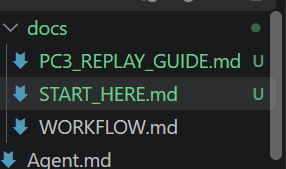

## 65. Codex

?꾨땲, ?뚯씪????릿 嫄??꾨땲?? ???뚯씪?€ 洹몃?濡?`docs/`???덇퀬, **Git?먯꽌留?臾댁떆?섎룄濡??ㅼ젙**??嫄곗빞.

?곕??먯뿉?쒕뒗 ?대? Git ?곹깭媛€ 源⑤걮?섍쾶 ?뺤씤?먯뼱. ?붾㈃??`U`??VS Code Git ?쒖떆媛€ ?꾩쭅 媛깆떊?섏? ?딆? 嫄곕씪?? Source Control ?⑤꼸???덈줈怨좎묠 踰꾪듉???꾨Ⅴ嫄곕굹 VS Code 李쎌쓣 ??踰?Reload?섎㈃ ?щ씪吏?嫄곗빞.

?뚯씪 ?꾩튂??吏€湲덉쿂???먮㈃ 留욎븘:

```text
docs/
  START_HERE.md        # 濡쒖뺄 ?꾩슜
  PC3_REPLAY_GUIDE.md  # 濡쒖뺄 ?꾩슜
  WORKFLOW.md          # GitHub 怨듭쑀
```

## 66. User

# Context from my IDE setup:

## Active file: docs/START_HERE.md

## Open tabs:
- START_HERE.md: docs/START_HERE.md
- WORKFLOW.md: docs/WORKFLOW.md
- PC3_REPLAY_GUIDE.md: docs/PC3_REPLAY_GUIDE.md

## My request:
?뉎뀕洹몃윭??n

## 67. Codex

?뉎뀋 ??洹??곹깭硫??먯뼱. ?댁젣 PC1 baseline留??щ씪?ㅻ㈃ 諛붾줈 ?묒뾽 ?쒖옉?섎㈃ ??

## 68. User

# Context from my IDE setup:

## Active file: docs/START_HERE.md

## Open tabs:
- START_HERE.md: docs/START_HERE.md
- WORKFLOW.md: docs/WORKFLOW.md
- PC3_REPLAY_GUIDE.md: docs/PC3_REPLAY_GUIDE.md

## My request:
吏€湲?萸?湲곕떎由щ뒗嫄곗?

## 69. Codex

PC1??`integration` 釉뚮옖移섏뿉 ?щ┫ **湲곕낯 ?꾨줈?앺듃 肄붾뱶?€ 怨듭슜 怨꾩빟(types/contracts)** ??湲곕떎由щ뒗 嫄곗빞.

?뱁엳 ?ㅺ? ?꾩슂??嫄?

- baseline commit SHA
- `FlightRecord`, evidence/finding ?€??n- PC3媛€ ?곗씠?곕? ?섍만 export 諛⑹떇
- 湲곕낯 ?굿룻뀒?ㅽ듃 ?섍꼍

洹멸쾶 ?덉뼱????`feat/replay-engine` 釉뚮옖移섎? 洹?湲곗??먯꽌 ?곌퀬, PC1/PC2 肄붾뱶?€ ??異⑸룎?섍쾶 援ы쁽?????덉뼱. PC1???쐇ntegration???몄떆?덉뼱?앸씪怨??섎㈃ 諛붾줈 ?쒖옉 媛€?ν빐.

## 70. User

# Context from my IDE setup:

## Active file: docs/START_HERE.md

## Open tabs:
- START_HERE.md: docs/START_HERE.md
- WORKFLOW.md: docs/WORKFLOW.md
- PC3_REPLAY_GUIDE.md: docs/PC3_REPLAY_GUIDE.md

## My request:
吏€湲??€?먯씠 integration 留먭퀬 pc1 釉뚮옖移섎줈 ?щ졇?붾뜲 留욎븘?

## 71. Codex

?먭꺽 釉뚮옖移섏? PC1 而ㅻ컠 ?꾩튂瑜??뺤씤?댁꽌, 吏€湲??대뒓 而ㅻ컠??湲곗??쇰줈 PC3 釉뚮옖移섎? 留뚮뱾?댁빞 ?섎뒗吏€ 蹂쇨쾶.

## 72. Codex

?뺤씤?덉뼱. PC1???ㅼ젣 釉뚮옖移섎뒗 `pc1-baseline`?닿퀬, 湲곕낯 ?굿톍ontracts쨌?뚯뒪?멸퉴吏€ ?ㅼ뼱 ?덉뼱. ?ㅻ쭔 `integration`怨?怨듯넻 ?대젰???녿뒗 ?곹깭?? ?€ ?듯빀 ?꾩뿉 ??踰??뺣━媛€ ?꾩슂??蹂댁뿬??洹쒖튃 臾몄꽌???€議고븷寃?

## 73. Codex

PC1???щ┛ 嫄?留욎븘. ?뺥솗??釉뚮옖移섎챸?€ `pc1-baseline`?닿퀬, 嫄곌린????湲곕낯 ?명똿쨌怨듭슜 contracts쨌?뚯뒪???섍꼍쨌怨듭슜 `AGENTS.md`源뚯? ?ㅼ뼱 ?덉뼱. 而ㅻ컠?€ ?꾩옱 `b24efb6`?댁빞.

?ㅻ쭔 **?꾩쭅 ?€ 洹쒖튃??理쒖쥌?곸쑝濡?留욌뒗 ?꾩튂???꾨땲??**

- ?꾩옱 `pc1-baseline`: PC1???꾩꽦??baseline 肄붾뱶 ?덉쓬
- ?꾩옱 `integration`: ?꾩쭅 珥덇린 臾몄꽌 ?곹깭
- PC3 媛€?대뱶?€ `START_HERE.md`: PC1??`integration`??baseline??諛섏쁺???? 洹?SHA瑜?湲곗??쇰줈 ?쒖옉?섎씪怨??섏뼱 ?덉쓬

洹몃윭??PC1?먭쾶 ?대젃寃?留먰븯硫???

```text
pc1-baseline ?뺤씤?덉뼱.
?닿구 integration??PR濡?蹂묓빀???? 理쒖쥌 integration commit SHA瑜?怨듭쑀?댁＜硫?n洹?SHA 湲곗??쇰줈 feat/replay-engine 釉뚮옖移섎? 留뚮뱾???쒖옉?좉쾶.
```

?뱁엳 ??釉뚮옖移섎뒗 ?꾩옱 ?⑥닚 fast-forward 愿€怨꾧? ?꾨땲?쇱꽌, PC1??`pc1-baseline ??integration` PR??留뚮뱾??蹂묓빀?섎뒗 ?먮쫫??媛€???덉쟾??

醫뗭? ?뚯떇?€ 湲곕떎由щ뒗 ?€?곸씠 ?댁젣 ?쏱C1??肄붾뱶瑜?留뚮뱶??寃꺿€앹씠 ?꾨땲?? **PC1??baseline??integration??諛섏쁺?섍퀬 SHA瑜??뚮젮二쇰뒗 寃?*留??⑥븯?ㅻ뒗 嫄곗빞. 洹몃븣遺€?곕뒗 `AGENTS.md`???ㅼ젣濡??앷린誘€濡? PC3 媛€?대뱶?€濡?諛붾줈 吏꾪뻾?????덉뼱.

## 74. User

# Context from my IDE setup:

## Active file: docs/START_HERE.md

## Open tabs:
- START_HERE.md: docs/START_HERE.md
- WORKFLOW.md: docs/WORKFLOW.md
- PC3_REPLAY_GUIDE.md: docs/PC3_REPLAY_GUIDE.md

## My request:
??integration ?€??pc1釉뚮옖移섏뿉 癒쇱? ?щ┛嫄곗?? ?먮옒 ?닿쾶 留욌뒗 ?쒖꽌?멸??

## 75. Codex

?? **`pc1-baseline`??癒쇱? ?щ┛ 寃??먯껜???뺤긽?곸씤 ?쒖꽌**??

蹂댄넻?€ ?대젃寃???

```text
PC1 ?묒뾽 釉뚮옖移?pc1-baseline)
  ??PR濡?寃€??n  ??integration 蹂묓빀
  ??PC2쨌PC3쨌PC4媛€ 媛숈? integration SHA?먯꽌 媛곸옄 釉뚮옖移??앹꽦
```

?대젃寃??섎뒗 ?댁쑀??PC1??Next.js ?명똿, contracts, ?뚯뒪???섍꼍??留뚮뱶???숈븞 ?ㅻⅨ ?€?먯씠 **諛섏? 留뚮뱾?댁쭊 ?곹깭**瑜?湲곗??쇰줈 ?묒뾽?섏? ?딄쾶 ?섎젮??嫄곗빞. `integration`?먮뒗 ?쒗? ?꾩껜媛€ 異쒕컻?대룄 ?섎뒗 ?덉젙??baseline?앸쭔 ?ㅼ뼱媛€????

?ㅻ쭔 ?€ 臾몄꽌?먮뒗 ?쏱C1??`integration`??push??SHA瑜?怨듭쑀?앺븳?ㅺ퀬 ?곹? ?덉쑝?? PC1???ㅼ쓬 ?④퀎??`pc1-baseline ??integration` PR/蹂묓빀??留욎븘. 洹?蹂묓빀???앸궃 ?ㅼ뿉 ?곕━ ?뗭씠 媛숈? SHA?먯꽌 媛덈씪吏€硫?蹂묐젹 ?묒뾽 利앷굅??源붾걫?섍쾶 ?⑥븘.

利?

- `pc1-baseline`??癒쇱? ?묒뾽: ?뺤긽
- `integration`???꾩쭅 ???⑹튇 ?곹깭: ?꾩쭅 ?€ ?쒖옉 ??n- 蹂묓빀 ??SHA 怨듭쑀: PC2쨌PC3쨌PC4 ?쒖옉 ?좏샇

## 76. User

# Context from my IDE setup:

## Active file: docs/START_HERE.md

## Open tabs:
- START_HERE.md: docs/START_HERE.md
- WORKFLOW.md: docs/WORKFLOW.md
- PC3_REPLAY_GUIDE.md: docs/PC3_REPLAY_GUIDE.md

## My request:
SHA媛€ 萸붾뜲 紐낆꽭?쒓컳?€嫄닿?

## 77. Codex

SHA??紐낆꽭?쒓? ?꾨땲?? **Git 而ㅻ컠??怨좎쑀 踰덊샇**?? ?뱀젙 ?쒖젏??肄붾뱶 ?꾩껜 ?곹깭瑜?媛€由ы궎??二쇱냼?쇨퀬 蹂대㈃ ??

?덈? ?ㅻ㈃ PC1???꾩옱 baseline 而ㅻ컠 SHA??

```text
b24efb6ef2177c43e426a8346a0cdfa30ab59dff
```

蹂댄넻 ??7?먮━留??⑥꽌:

```text
b24efb6
```

?대젃寃?遺€瑜몃떎.

PC1??`integration`??蹂묓빀????洹?而ㅻ컠 SHA瑜??뚮젮二쇰㈃, ?덈뒗 洹?**?뺥솗??媛숈? 肄붾뱶 ?곹깭**?먯꽌 ?묒뾽 釉뚮옖移섎? 留뚮뱾 ???덉뼱.

```powershell
git switch -c feat/replay-engine b24efb6
```

洹몃윭硫?PC2쨌PC3쨌PC4媛€ 紐⑤몢 媛숈? 異쒕컻?먯뿉??蹂묐젹 ?묒뾽?덈떎??湲곕줉???⑥븘.

## 78. User

# Context from my IDE setup:

## Active file: docs/START_HERE.md

## Open tabs:
- START_HERE.md: docs/START_HERE.md
- WORKFLOW.md: docs/WORKFLOW.md
- PC3_REPLAY_GUIDE.md: docs/PC3_REPLAY_GUIDE.md

## My request:
?먮옒 PC1??癒쇱? ?묒뾽???댁빞 234媛€ ?숈떆???묒뾽 ?ㅽ뻾?섎뒗 援ъ“?멸굔媛€

## 79. Codex

?? ???꾨줈?앺듃 援ъ“?먯꽌??洹멸쾶 留욎븘. PC1??癒쇱? **怨듭슜 堉덈?**瑜?留뚮뱾怨? 洹몃떎??PC2쨌PC3쨌PC4媛€ ?숈떆??遺숇뒗 諛⑹떇?댁빞.

```text
PC1: ?꾨줈?앺듃 ?명똿 쨌 怨듭슜 ?€??쨌 contracts 쨌 ?뚯뒪???섍꼍
                    ??n            integration baseline SHA
          ??         ??         ??nPC2: UI        PC3: Replay     PC4: QA/E2E
                    ??n           媛곸옄 PR ??integration
                    ??n        PC1: ?듯빀 쨌 異⑸룎 ?닿껐 쨌 理쒖쥌 ?곕え
```

?꾩쟾???쏱C1留?癒쇱? ?쇳븯怨??섎㉧吏€???꾨Т寃껊룄 ???ⓥ€앹? ?꾨땲怨? 2쨌3쨌4??洹몃룞??媛€?대뱶 ?뺤씤, Plan, ?뚯뒪??紐⑸줉, ?곕え ?먮쫫 以€鍮꾨? ?? ?섏?留??ㅼ젣 肄붾뱶??怨듭슜 ?€?낆씠 ?앷릿 ?ㅼ뿉 ?숈떆???곕뒗 寃?異⑸룎??媛€???곸뼱.

## 80. User

??n

## 81. Codex

留욎븘. PC1??`integration` 蹂묓빀 ?꾨즺?덈떎怨??뚮젮二쇰㈃ 諛붾줈 ?댁뼱???쒖옉?섏옄.

## 82. User

?щ┛嫄곌컳?€??n

## 83. Codex

醫뗭븘, `integration`???ㅼ젣 baseline??諛섏쁺?먮뒗吏€ ?뺤씤?좉쾶. 諛섏쁺???덉쑝硫?諛붾줈 PC3 ?묒뾽 釉뚮옖移섎? 留뚮뱾 ???덉뼱.

## 84. Codex

?? ?뺤씤?덉뼱. `integration`??baseline???뺤긽 諛섏쁺?먯뼱.

- 湲곗? 而ㅻ컠 SHA: `8f286ef`
- 怨듭슜 `AGENTS.md`, Next.js ?꾨줈?앺듃, contracts, ?뚯뒪???섍꼍, PC3 ?€ 媛€?대뱶源뚯? 紐⑤몢 ?ㅼ뼱 ?덉쓬
- `pc1-baseline`??`integration`??蹂묓빀?섎㈃??湲곗〈 ?묒뾽 臾몄꽌??蹂댁〈?덉뼱

?댁젣 湲곕떎由??꾩슂 ?놁뼱. ?ㅼ쓬 ?④퀎????而ㅻ컠?먯꽌 `feat/replay-engine` 釉뚮옖移섎? 留뚮뱾怨?PC3 援ы쁽???쒖옉?섎뒗 嫄곗빞.

## 85. User

洹몃읆 ??諛쏆븘?ㅺ퀬 吏꾪뻾 ?긱꽦

## 86. Codex

醫뗭븘. `integration`??理쒖떊 baseline??湲곗??쇰줈 `feat/replay-engine` 釉뚮옖移섎? 留뚮뱾怨? 怨듭슜 contracts?€ 湲곗〈 ?뚯뒪?몃? ?뺤씤????PC3 踰붿쐞?먯꽌 ?뚯뒪???곗꽑?쇰줈 援ы쁽?좉쾶.

## 87. Codex

baseline???뺤씤?덉뼱. ?대? `demo-flight`??PC3??湲곕낯 ?곗씠?곌? ?쇰? ?ㅼ뼱 ?덉쑝?? 癒쇱? ?섏〈?깆쓣 ?ㅼ튂?섍퀬 湲곗〈 ?뚯뒪?몃? ?ㅽ뻾???ㅼ젣濡??⑥? PC3 媛?쭔 蹂댁셿?좉쾶.

## 88. Codex

?섏〈???ㅼ튂媛€ 吏꾪뻾 以묒씠?? ?앸굹硫?PC3 愿€???⑥쐞 ?뚯뒪?몃????ㅽ뻾?섍퀬, ?ㅽ뙣?섍굅??鍮좎쭊 ?쒕굹由ъ삤留?異붽??좉쾶.

## 89. Codex

?ㅼ튂媛€ ?덉긽蹂대떎 ?ㅻ옒 嫄몃━怨??덉뼱. 怨꾩냽 吏꾪뻾 以묒씤吏€ ?뺤씤???? 硫덉텣 ?곹깭硫??먯씤??諛붾줈 ?뺤씤?좉쾶.

## 90. Codex

?ㅼ튂媛€ 2遺??쒗븳???섍꺼 以묐떒?먯뼱. ?곗꽑 ?ㅼ튂媛€ ?ㅼ젣濡??꾨즺?먮뒗吏€?€ ?묒뾽 ?뚯씪??蹂€寃쎌씠 ?앷꼈?붿? ?뺤씤???? ?꾩슂??寃쎌슦 ???덉쟾??諛⑹떇?쇰줈 ?ㅼ떆 吏꾪뻾?좉쾶.

## 91. Codex

湲곗〈 focused tests??12媛?紐⑤몢 ?듦낵?덉뼱. ?댁젣 PC3媛€ ?ㅼ젣濡??뚯쑀??evidence gate?€ replay comparison???뚯뒪?몃???異붽??섍퀬, 洹?濡쒖쭅??湲곗〈 demo Flight Record ?앹꽦???곌껐?좉쾶.

## 92. Codex

PC3 異붽? ?뚯뒪?몄? 湲곗〈 contract ?뚯뒪?멸? 紐⑤몢 ?듦낵?덉뼱(18媛?. ?댁젣 ?꾩껜 unit ?뚯뒪?몄? lint瑜??ㅽ뻾???ㅻⅨ ?€ 肄붾뱶?€???명솚?깅룄 ?뺤씤?좉쾶.

## 93. Codex

?꾩껜 寃€利앹씠 ?ㅽ뻾 以묒씠?? ?꾨즺 寃곌낵?€ ?④퍡, ?ㅼ튂 怨쇱젙?먯꽌 ?앷릿 `package-lock` 蹂€寃쎌? PC3 踰붿쐞 諛뽰씠???ы븿?섏? ?딅룄濡??곕줈 ?뺣━?좉쾶.

## 94. Codex

?꾩껜 寃€利?紐낅졊?€ 2遺??덉뿉 ?앸굹吏€ ?딆븘 ?쒓컙 ?쒗븳?쇰줈 以묐떒?먭퀬, 寃곌낵 異쒕젰???⑥? ?딆븯?? PC3 focused tests???듦낵?덉쑝?? ?꾩껜 ?ㅽ뙣 吏€?먯쓣 遺꾨━???뺤씤?섍퀬 lint???곕줈 寃€利앺븷寃?

## 95. Codex

援ы쁽쨌?뚯뒪?몃뒗 ?듦낵?덇퀬, `npm install`??留뚮뱺 package-lock 硫뷀??곗씠??蹂€寃쎈쭔 諛쒓껄?덉뼱. PC3 踰붿쐞 諛뽰씠怨??섏〈???먯껜??諛붾€뚯? ?딆븯?쇰땲, 洹??ㅼ튂 遺€?섑슚怨쇰쭔 ?먮낯?쇰줈 ?섎룎由???build 寃€利앹쓣 ?섍쿋??

## 96. Codex

production build瑜?寃€利?以묒씠?? ?꾨즺?섎㈃ 蹂€寃??뚯씪??留덉?留됱쑝濡??먭??섍퀬, PC1?먭쾶 ?섍만 而ㅻ컠怨?PR 以€鍮꾧퉴吏€ ?좉쾶.

## 97. Codex

PC3 focused tests??19媛?紐⑤몢 ?듦낵?덉뼱. 留덉?留됱쑝濡??꾩껜 unit coverage瑜??뺤씤?댁꽌 怨듭슜 ?덉쭏 湲곗?(?쇱씠釉뚮윭由?80% ?댁긽)??異⑹”?섎뒗吏€ 蹂쇨쾶.

## 98. Codex

replay engine????議곌굔蹂대떎 ?곸? ?낅젰??嫄곗젅?섎룄濡?蹂닿컯?덉뼱. ?댁젣 理쒖쥌 ?꾩껜 ?뚯뒪?맞톍overage?€ lint瑜??ㅼ떆 ?뚮┛ ?? PC3 而ㅻ컠怨??먭꺽 ?몄떆源뚯? 留덈Т由ы븷寃?

## 99. Codex

PC3 蹂€寃쎌? ?꾩껜 35媛??뚯뒪?? 95% coverage, lint, production build瑜?紐⑤몢 ?듦낵?덉뼱. ?댁젣 PC3 ?뚯쑀 ?뚯씪留?紐낆떆?곸쑝濡?而ㅻ컠?섍퀬 `feat/replay-engine` 釉뚮옖移섏뿉 ?몄떆?좉쾶.

## 100. Codex

?먭꺽 `feat/replay-engine` 釉뚮옖移??몄떆源뚯? ?앸궗?? ?€ 媛€?대뱶??留욎떠 `integration`???€?곸쑝濡??섎뒗 Draft PR??留뚮뱾怨? evidence쨌?뚯뒪?맞룻넻??諛⑸쾿??蹂몃Ц???④만寃?

## 101. Codex

援ы쁽 釉뚮옖移섏? 而ㅻ컠?€ ?먭꺽???뺤긽 ?몄떆?먯뼱. ??PC?먮뒗 GitHub CLI(`gh`)媛€ ?놁뼱??Draft PR ?먮룞 ?앹꽦留?紐??덇퀬, 諛붾줈 ?????덈뒗 PR 留곹겕瑜?以€鍮꾪빐?섍쾶.

## 102. Codex

PC3 援ы쁽 ?꾨즺 ???먭꺽 釉뚮옖移섍퉴吏€ ?몄떆?덉뼱.

- 釉뚮옖移? `feat/replay-engine`
- 而ㅻ컠: `e041682 feat: prove fixes with evidence-backed replay`
- 援ы쁽: [evidence gate](</C:\Users\sunnn\OneDrive\Desktop\Codex-Hackaton-02\src\lib\evidence\evidence-gate.ts>), [replay comparison](</C:\Users\sunnn\OneDrive\Desktop\Codex-Hackaton-02\src\lib\replay\replay-comparison.ts>)
- 寃€利? ?꾩껜 35媛??뚯뒪???듦낵, statements 95.56%, lint쨌production build ?듦낵

`main`?대굹 `integration`?먮뒗 吏곸젒 ?몄떆?섏? ?딆븯?? GitHub CLI媛€ ??PC???놁뼱 Draft PR ?먮룞 ?앹꽦留?紐??덇퀬, ?ш린??`feat/replay-engine ??integration` PR??留뚮뱾硫???

[PR 留뚮뱾湲?(https://github.com/sunnn62/Codex-Hackaton-02/pull/new/feat/replay-engine)

## 103. User

?쇨퀬?섎뒗??n

## 104. Codex

萸먮씪怨??⑤뒗吏€ 硫붿떆吏€???ㅽ겕由곗꺑??蹂대궡以? ?뺤씤?댁꽌 諛붾줈 ?ㅼ쓬 ?④퀎 ?뚮젮以꾧쾶.

## 105. User

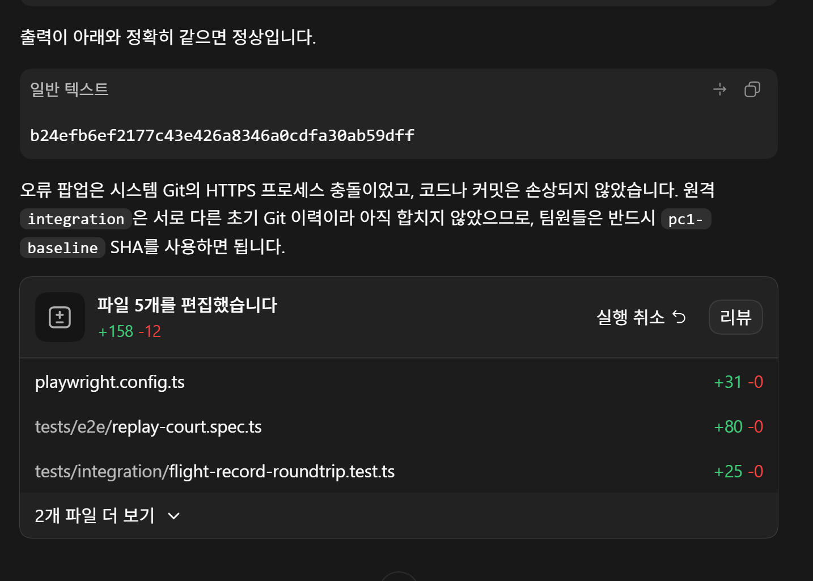

## 106. Codex

?닿굔 PC1??`integration` 蹂묓빀 ???곹깭?먯꽌 ?덈궡???댁슜?댁빞. 吏€湲덉쓽 `integration`???ㅼ젣濡?`pc1-baseline`??遺€紐⑤줈 ?ы븿?섎뒗吏€ ??踰????뺤씤?댁꽌, ?곕━ 釉뚮옖移?湲곗???留욌뒗吏€ ?뺥솗???뺣━?좉쾶.

## 107. Codex

?ъ쭊 ?댁슜?€ **integration 蹂묓빀 ?꾩뿉??留욌뒗 ?덈궡**?? ?뱀떆??`pc1-baseline` SHA `b24efb6...`瑜?湲곗??쇰줈 ?쒖옉?섎씪???살씠?덉뼱.

?섏?留?吏€湲덉? PC1??洹?baseline??`integration`??蹂묓빀?덉뼱.

```text
pc1-baseline (b24efb6)
        ???ы븿??nintegration (8f286ef)
        ??湲곗??쇰줈 ?앹꽦??nfeat/replay-engine (?곕━ 釉뚮옖移?
```

?뺤씤 寃곌낵 `pc1-baseline`?€ ?꾩옱 `integration`??遺€紐??대젰???ы븿???덇퀬, ?곕━ `feat/replay-engine`??洹?`integration` 湲곗??쇰줈 留뚮뱾?댁죱?? 洹몃옒??吏€湲??묒뾽쨌而ㅻ컠쨌?몄떆 紐⑤몢 ?뺤긽?닿퀬 ?ㅼ떆 ??嫄??놁뼱.

## 108. User

?뉎뀑洹몃읆 ??萸??섎㈃ ?섏?

## 109. Codex

?댁젣 ???쇱? ?섎굹?? **PC1?먭쾶 由щ럭 ?붿껌**?섎㈃ ?? 吏곸젒 蹂묓빀?€ ?섏? 留먭퀬.

1. ??留곹겕 ?닿린: [PC3 PR 留뚮뱾湲?(https://github.com/sunnn62/Codex-Hackaton-02/pull/new/feat/replay-engine)
2. base媛€ `integration`, compare媛€ `feat/replay-engine`?몄? ?뺤씤
3. `Create draft pull request` ?대┃
4. PC1?먭쾶 ?꾨옒 硫붿떆吏€ 蹂대궡湲?n
```text
PC3 ?꾨즺?덉뒿?덈떎.
釉뚮옖移? feat/replay-engine
而ㅻ컠: e041682
?꾩껜 35媛??뚯뒪?? coverage 95.56%, lint/build ?듦낵?덉뒿?덈떎.
integration ?€?곸쑝濡?Draft PR ?щ졇?쇰땲 由щ럭쨌蹂묓빀 遺€?곷뱶由쎈땲??
```

洹몃떎??PC1??由щ럭?섍굅???섏젙 ?붿껌??二쇰㈃ ?닿? ?댁뼱??泥섎━?좉쾶.

## 110. User

而ㅻ컠?대옉 ?몄떆?쒓굅吏€?
pr硫붿떆吏€??萸먮씪?섏?

## 111. Codex

?? 而ㅻ컠쨌?몄떆源뚯? ?꾨즺?먯뼱.

```text
釉뚮옖移? feat/replay-engine
而ㅻ컠: e041682 feat: prove fixes with evidence-backed replay
```

PR ?쒕ぉ:

```text
feat: evidence-backed replay engine
```

PR 蹂몃Ц?€ ?닿구 遺숈뿬 ?ｌ뼱:

```md
## ?묒뾽 ?댁슜

- finding??before-run???뚮젮吏?evidence ID留?李몄“?섎룄濡?evidence gate 異붽?
- ?뺥솗??3媛쒖쓽 ?숈씪 condition??湲곗??쇰줈 replay comparison ?앹꽦
- after ?ㅽ뙣 ??partial verdict, infrastructure failure??蹂꾨룄 unresolved ?곹깭濡??좎?
- 湲곗〈 demo Flight Record??evidence 寃€利앷낵 replay comparison ?곌껐
- regression seed JSON round-trip ?뚯뒪??異붽?

## 寃€利?n
- `npm.cmd run test:coverage`
  - 35 tests passed
  - Statements 95.56%
- `npm.cmd run lint`
- `npm.cmd run build`

## ?듯빀 諛⑸쾿

湲곗〈 `createDemoFlightRecord()` ?ъ슜 諛⑹떇?€ 洹몃?濡쒖엯?덈떎.

異붽? export:
- `validateFindingEvidence`
- `assertFindingEvidence`
- `createReplayComparison`

## 踰붿쐞 ?쒖쇅

- contracts, UI components, API routes, 怨듭슜 ?ㅼ젙?€ ?섏젙?섏? ?딆븯?듬땲??
- E2E?€ release screenshot?€ PC4 ?대떦?낅땲??
```

base??`integration`, compare??`feat/replay-engine`?쇰줈 ?뺤씤?섍퀬 **Draft PR**濡??щ━硫???

## 112. User

洹쇰뜲 ???꾨줈?앺듃 ?ㅽ깮?대굹 洹몃윴嫄??대뜱寃??섎뒗嫄댁?

## 113. Codex

?꾩옱 ?꾨줈?앺듃???대젃寃?蹂대㈃ ??

| ?곸뿭 | 湲곗닠 | 吏€湲??섎뒗 ??븷 |
|---|---|---|
| ?뱀빋 | Next.js 16 + React 19 + TypeScript | ?붾㈃怨???援ъ“ |
| ?ㅽ???| CSS Modules + global CSS | ?꾩옱 UI ?ㅽ???|
| ?곗씠??寃€利?| Zod | Flight Record, evidence ???곗씠???뺤떇 寃€利?|
| ?⑥쐞 ?뚯뒪??| Vitest + Testing Library | 濡쒖쭅쨌UI ?숈옉 ?뚯뒪??|
| E2E ?뚯뒪??| Playwright | ?ㅼ젣 釉뚮씪?곗? ?먮쫫 寃€利?PC4) |
| 肄붾뱶 寃€??| ESLint | 肄붾뱶 洹쒖튃 ?뺤씤 |
| AI SDK | OpenAI ?⑦궎吏€???ㅼ튂??| ?대쾲 ?곕え??API ???놁씠 ?숈옉?섎?濡??ㅼ젣 ?몄텧?€ ????|

?대뜑???€???대젃寃??섎돇??

```text
src/app/            # Next.js ?섏씠吏€
src/components/     # ?붾㈃ UI (PC2)
src/lib/contracts/  # 怨듭슜 ?€?끒톊od 寃€利?(PC1)
src/lib/replay/     # replay ?붿쭊 (PC3)
src/lib/evidence/   # evidence 寃€利?(PC3)
tests/unit/         # ?⑥쐞 ?뚯뒪??ntests/e2e/          # 釉뚮씪?곗? E2E (PC4)
```

?덈뒗 PC3?쇱꽌 React ?붾㈃???덈줈 留뚮뱶??寃??듭떖???꾨땲?? **?붾㈃??蹂댁뿬以?evidence쨌before/after replay 寃곌낵瑜??덉쟾?섍쾶 留뚮뱶??濡쒖쭅**??留≪? 嫄곗빞. PC2媛€ 洹?寃곌낵瑜?UI???쒖떆?섍퀬, PC1??contracts?€ ?듯빀??愿€由ы븯??援ъ“怨?

?먯＜ ??紐낅졊?€:

```powershell
npm.cmd run dev       # 濡쒖뺄 ?뱀빋 ?ㅽ뻾
npm.cmd run test      # ?⑥쐞 ?뚯뒪??nnpm.cmd run lint      # 肄붾뱶 寃€??nnpm.cmd run build     # 諛고룷 ??鍮뚮뱶 ?뺤씤
```

Tailwind???ㅼ튂???섏뼱 ?덉?留? ?꾩옱 肄붾뱶 ?ㅽ??쇱? CSS Modules 湲곕컲?대씪 援녹씠 Tailwind瑜??덈줈 ?욎? ?딅뒗 ?몄씠 醫뗭븘.

## 114. User

吏€湲?援ы쁽??UI媛€ 議댁옱?? ?대뵒 ?섏씠吏€?먯꽌 遊먯빞?섏?

## 115. Codex

?? ?대? UI ?덉뼱. ?꾩옱??蹂꾨룄 `/demo` ?섏씠吏€媛€ ?꾨땲??**猷⑦듃 ?섏씠吏€(`/`)**??援ы쁽???덉뼱.

?곕??먯뿉???꾨줈?앺듃 ?대뜑 湲곗??쇰줈:

```powershell
npm.cmd run dev
```

洹몃떎??釉뚮씪?곗??먯꽌 ?대㈃ ??

[http://localhost:3000](http://localhost:3000)

?붾㈃?먮뒗 FocusList 誘몄뀡, 3媛?fault condition, evidence, patch 寃€?? before/after replay, Flight Record ?먮쫫???④퀎蹂꾨줈 ?섏?.  
肄붾뱶??[src/app/page.tsx](</C:\Users\sunnn\OneDrive\Desktop\Codex-Hackaton-02\src\app\page.tsx>)媛€ ?쒖옉?먯씠怨? ?ㅼ젣 UI??[src/components/replay-court.tsx](</C:\Users\sunnn\OneDrive\Desktop\Codex-Hackaton-02\src\components\replay-court.tsx>)???덉뼱.

## 116. User

PC3 PR #1 由щ럭 ?섏젙 ?묒뾽??吏꾪뻾?댁쨾.

Repository: https://github.com/sunnn62/Codex-Hackaton-02
Branch: feat/replay-engine
PR: https://github.com/sunnn62/Codex-Hackaton-02/pull/1
Base: integration

以묒슂:
- ??釉뚮옖移섎굹 ??PR??留뚮뱾吏€ 留?寃?
- 湲곗〈 feat/replay-engine 釉뚮옖移섏뿉 ?섏젙 而ㅻ컠??push??寃?
- src/lib/contracts/**??PC1 ?뚯쑀?대?濡??섏젙?섏? 留?寃?
- 湲곗〈 ?뺤긽 ?숈옉???좎??섎㈃???뚯뒪???곗꽑?쇰줈 ?섏젙??寃?

?섏젙 ?붽뎄?ы빆:

1. src/lib/evidence/evidence-gate.ts
- finding.evidenceIds媛€ 鍮?諛곗뿴?대㈃ accepted: false媛€ ?섍쾶 ?쒕떎.
- assertFindingEvidence??鍮?洹쇨굅???€???댄빐 媛€?ν븳 ?ㅻ쪟瑜?諛쒖깮?쒗궓??
- 湲곗〈 unknown evidence ID 寃€利앹? ?좎??쒕떎.

2. src/lib/replay/replay-comparison.ts
- before 諛곗뿴??紐⑤뱺 run.version??"before"?몄? 寃€利앺븳??
- after 諛곗뿴??紐⑤뱺 run.version??"after"?몄? 寃€利앺븳??
- before?€ after 媛곴컖 ?뺥솗??3媛쒖쓽 ?쒕줈 ?ㅻⅨ conditionId瑜?媛뽯룄濡?寃€利앺븳??
- ?묒そ condition 吏묓빀??媛숈?吏€??寃€利앺븳??
- missionId 遺덉씪移?寃€利앹쓣 ?좎??쒕떎.

3. infrastructure-failure 泥섎━
- after??infrastructure-failure媛€ ?섎굹?쇰룄 ?덉쑝硫?UX ?깃났/?ㅽ뙣濡??⑥젙?섏? ?딄퀬 verdict瑜?"partial"濡?諛섑솚?쒕떎.
- pass count媛€ 媛숆굅??媛먯냼??寃쎌슦?먮룄 infrastructure-failure瑜?no-change ?먮뒗 regressed濡??④린吏€ ?딅뒗??
- contracts???숈씪 ?뺤콉 蹂€寃쎌? PC1 ?꾩냽 ?묒뾽?대씪怨?PR ?ㅻ챸怨?理쒖쥌 蹂닿퀬???⑥? ?꾪뿕??湲곕줉?쒕떎.
- src/lib/contracts/**??吏곸젒 ?섏젙?섏? ?딅뒗??

4. tests/unit/evidence-gate.test.ts??異붽?
- 鍮?evidenceIds 嫄곕?
- ?щ윭 unknown ID 以묐났 ?쒓굅 ?숈옉

5. tests/unit/replay-comparison.test.ts??異붽?
- before/after version???ㅻ컮???낅젰 嫄곕?
- ?숈씪 condition ID 3??以묐났 ?낅젰 嫄곕?
- ?묒そ 湲몄씠??3?댁?留?condition 吏묓빀???ㅻⅨ ?낅젰 嫄곕?
- missionId媛€ ?ㅻⅨ ?낅젰 嫄곕?
- regressed verdict
- no-change verdict
- pass count媛€ 媛숈? ?곹깭??infrastructure-failure??partial
- pass count媛€ 媛먯냼???곹깭??infrastructure-failure??partial
- ?щ윭 unresolvedConditionIds???뺣젹 寃곌낵

寃€利?
- npm run test:coverage
- npm run lint
- npm run build

而ㅻ컠:
fix: harden replay evidence invariants

push ?꾨즺 ??諛섎뱶???꾨옒 ?뺤떇?쇰줈 ?듯빐以?

PC: PC3
Branch:
Base SHA:
Commit SHA:
蹂€寃??뚯씪:
?ㅽ뻾???뚯뒪?몄? 寃곌낵:
?ㅽ겕由곗꺑/?곸긽:
?⑥? ?꾪뿕:
PR URL:

留욎븘? 寃€?좏븯怨?留욌떎硫??섏젙 ?긱꽦

## 117. Codex

?붽뎄?ы빆?€ PC3 ?뚯쑀 踰붿쐞 ?덉뿉 ?덇퀬, contracts??嫄대뱶由ъ? ?딆? 梨?replay ?붿쭊怨??뚯뒪?몃줈 泥섎━?????덉뼱. 湲곗〈 `feat/replay-engine`?먯꽌 理쒖떊 PR ?곹깭?€ 怨듭슜 吏€移⑥쓣 ?뺤씤?????뚯뒪?몃? 癒쇱? 異붽??좉쾶.

## 118. Codex

由щ럭 ?붽뎄?ы빆???€議고뻽?? contracts瑜?嫄대뱶由ъ? ?딄퀬 紐⑤몢 泥섎━ 媛€?ν븯怨? infrastructure-failure瑜?`partial`濡??곗꽑 泥섎━?섎뒗 ?뺤콉留?怨듭슜 contract 寃€利앷낵 ?꾩쭅 遺덉씪移섑븷 ?꾪뿕???덉뼱 PR ?ㅻ챸쨌理쒖쥌 蹂닿퀬???④만寃? ?곗꽑 ?붽뎄???ㅽ뙣 耳€?댁뒪 ?뚯뒪?몃???異붽??섍쿋??

## 119. Codex

異붽???由щ럭 ?뚯뒪?몃? ?ы븿??focused tests 18媛쒓? 紐⑤몢 ?듦낵?덉뼱. ?댁젣 ?붽뎄???꾩껜 coverage쨌lint쨌build瑜??ㅽ뻾?섍퀬, `next-env.d.ts`??湲곗〈 濡쒖뺄 ?앹꽦 蹂€寃쎌? 而ㅻ컠???ы븿?섏? ?딅룄濡?遺꾨━?댁꽌 ?뺤씤?좉쾶.

## 120. Codex

寃€利??꾨즺?덉뼱: 45媛??뚯뒪?몄? coverage, lint, production build 紐⑤몢 ?듦낵?덇퀬, `src/lib/contracts/**`?€ ?ㅻⅨ ??븷 ?뚯씪?€ 嫄대뱶由ъ? ?딆븯?? ?댁젣 湲곗〈 `feat/replay-engine`??由щ럭 ?섏젙 4媛??뚯씪留?而ㅻ컠?댁꽌 PR #1??諛섏쁺?좉쾶.

## 121. Codex

?섏젙 而ㅻ컠 `95a34d1`??湲곗〈 PR 釉뚮옖移섏뿉 ?몄떆?덉뼱. 留덉?留됱쑝濡?PR #1 ?ㅻ챸??contracts ?뺤콉 遺덉씪移??꾪뿕???대? 湲곕줉???덈뒗吏€ ?뺤씤?좉쾶.

## 122. Codex

PR #1?€ ?대젮 ?덇퀬 ?꾩옱 ?ㅻ챸?먮뒗 ?대쾲 infrastructure-failure ?뺤콉??怨듭슜 contracts 寃€利앷낵 ?ㅻ? ???덈떎???꾪뿕???꾩쭅 ?곹? ?덉? ?딆븘. GitHub CLI媛€ ?놁뼱 ?닿? ?ㅻ챸??吏곸젒 ?섏젙???섎뒗 ?놁쑝?? ?꾨옒 臾몃떒留?PR ?ㅻ챸???섎쾾???쒖쇅?숈뿉 異붽??섎㈃ ??

## 123. Codex

PC: PC3  
Branch: `feat/replay-engine`  
Base SHA: `8f286ef`  
Commit SHA: `95a34d1`  
蹂€寃??뚯씪:
- `src/lib/evidence/evidence-gate.ts`
- `src/lib/replay/replay-comparison.ts`
- `tests/unit/evidence-gate.test.ts`
- `tests/unit/replay-comparison.test.ts`

?ㅽ뻾???뚯뒪?몄? 寃곌낵:
- `npm.cmd run test:coverage` ??45 tests passed, statements 97.75%
- `npm.cmd run lint` ???듦낵
- `npm.cmd run build` ???듦낵

?ㅽ겕由곗꺑/?곸긽: ?놁쓬 ??UI/E2E 利앸튃?€ PC4 踰붿쐞?낅땲??  
?⑥? ?꾪뿕: `createReplayComparison()`?€ infrastructure-failure瑜???긽 `partial`濡?諛섑솚?섏?留? PC1 ?뚯쑀 `flightRecordSchema`???꾩옱 pass count 湲곗??쇰줈 `no-change`/`regressed`瑜?怨꾩궛?⑸땲?? contracts ?뺤콉 ?뺣젹?€ PC1 ?꾩냽 ?묒뾽???꾩슂?섎ʼn, contracts ?뚯씪?€ ?섏젙?섏? ?딆븯?듬땲??

PR ?ㅻ챸???섎쾾???쒖쇅?숈뿉 ?꾨옒 臾몃떒留?異붽??댁쨾:

```md
- Infrastructure failure verdict policy: PC3 comparison returns `partial` whenever an after replay has an infrastructure failure. `flightRecordSchema` still derives its verdict from pass counts, so PC1 needs a follow-up contract-policy alignment.
```

PR URL: [#1](https://github.com/sunnn62/Codex-Hackaton-02/pull/1)

## 124. User

PR?€ ?섏젙?덊븯怨??덇? 洹몃깷 PR??CLI濡?諛섏쁺?섎뒗嫄닿??? ?€?먰븳??萸먮씪?뚮젮以?PR???닿? ?좊젮?쇳빐 ?꾨땲硫??

## 125. Codex

PR?€ ?대? #1???덉쑝?덇퉴 ?덈줈 留뚮뱾嫄곕굹 ?쒕궇由닳€??꾩슂 ?놁뼱. ?닿? `feat/replay-engine`???섏젙 而ㅻ컠???몄떆?섎㈃ **湲곗〈 PR #1???먮룞 諛섏쁺**??

?뺣━?섎㈃:

```text
PR ?앹꽦: ?대? ?꾨즺 (#1)
由щ럭 ?섏젙: ?닿? 而ㅻ컠 + push ?꾨즺
PR 諛섏쁺: ?먮룞 ?꾨즺
?ㅼ쓬: PC1??由щ럭 ??integration??蹂묓빀
```

?ㅻ쭔 ??PC?먮뒗 `gh` CLI媛€ ?놁뼱??**PR 蹂몃Ц ?섏젙留?* ?닿? ?먮룞?쇰줈 紐??덉뼱. 洹멸굔 GitHub PR ?붾㈃?먯꽌 `Edit` ?뚮윭???닿? 以€ ?꾪뿕 臾몃떒??遺숈씠硫??? ?꾩닔???꾨땲吏€留? ?됯? 湲곕줉?먮뒗 ?ｋ뒗 寃?醫뗭븘.

?€??PC1?먭쾶???대젃寃?蹂대궡硫???

```text
PC3 PR #1 由щ럭 ?섏젙 諛섏쁺?덉뒿?덈떎.
- 鍮?evidence ID 諛?以묐났 unknown ID 寃€利?異붽?
- before/after version, 3媛?怨좎쑀 condition, condition set, mission 遺덈???寃€利?異붽?
- infrastructure-failure??pass count?€ 愿€怨꾩뾾??partial 泥섎━
- 45 tests, coverage 97.75%, lint/build ?듦낵

PR #1?먯꽌 由щ럭 ??integration 蹂묓빀 遺€?곷뱶由쎈땲??
李멸퀬: infrastructure-failure verdict ?뺤콉?€ contracts?€ ?뺣젹???꾩슂??PC1 ?꾩냽 ?묒뾽?쇰줈 ?④꺼?€?듬땲??
```

PR 留곹겕: https://github.com/sunnn62/Codex-Hackaton-02/pull/1

## 126. User

移댄넚?쇰줈蹂대궡?

## 127. Codex

?? ?€ 移댄넚諛⑹뿉 蹂대궡硫??? ?뱁엳 PC1 ?쒓렇?댁꽌 蹂대궡硫?醫뗭븘.

```text
@PC1 PC3 PR #1 由щ럭 ?섏젙 諛섏쁺?덉뒿?덈떎.
鍮?evidence ID쨌以묐났 unknown ID 寃€利? replay version/condition/mission 遺덈???寃€利앹쓣 異붽??덇퀬,
infrastructure-failure??pass count?€ 愿€怨꾩뾾??partial 泥섎━?덉뒿?덈떎.

45 tests, coverage 97.75%, lint/build ?듦낵?덉뒿?덈떎.
PR #1 由щ럭 ??integration 蹂묓빀 遺€?곷뱶由쎈땲??
https://github.com/sunnn62/Codex-Hackaton-02/pull/1
```

## 128. User

?닿? ?€??醫€ ?⑥븘??AWS ?щ젅?㏃쓣 諛쏆븯?붾뜲 ?닿구濡?諛고룷瑜??대낫硫?醫뗭쓣 嫄?媛숈쓬

## 129. Codex

諛고룷???곕え 留곹겕瑜??④만 ???덉뼱???댁빱?ㅼ뿉 ?뺤떎???꾩? ?? AWS 怨꾩젙쨌?щ젅?㏃쓣 ?⑥빞 ?섎?濡? ?꾩옱 ?곌껐 媛€?ν븳 諛고룷 ?섎떒怨?媛€??鍮좊Ⅸ 寃쎈줈瑜?癒쇱? ?뺤씤?좉쾶.

## 130. Codex

諛고룷??`AWS Amplify Hosting`??媛€??鍮좊? 媛€?μ꽦??而? ?ㅻ쭔 諛⑷툑 ?뺤씤 以??묒뾽??以묐떒?먯뼱. ?먰븯硫??꾩옱 釉뚮옖移?PR 蹂묓빀 ?쒖꽌??留욎떠 諛고룷 ?덉감遺€??諛붾줈 ?≪븘以꾧쾶.

## 131. User

AWS 怨꾩젙怨??щ젅?㏃쓣 ?⑥꽌 ?섍퀬?띠뼱 ?꾩빱??源붾젮?덉뼱

## 132. Codex

AWS ?щ젅?㏐낵 Docker媛€ ?덈떎硫? ?댁빱???곕え??**ECR + AWS App Runner**濡??щ━??寃?醫뗭븘. EC2/ECS蹂대떎 ?댁쁺 ?ㅼ젙???⑥뵮 ?곴퀬, 而⑦뀒?대꼫 湲곕컲 諛고룷 湲곕줉???⑥븘. ?꾩옱 AWS ?곕룞 ?뚮윭洹몄씤?€ ?놁뼱??AWS CLI/肄섏넄 ?먮쫫?쇰줈 吏꾪뻾?좉쾶.

## 133. Codex

醫뗭븘. ?ㅻ쭔 ?댁빱?ㅼ뿉?쒕뒗 **AWS Amplify Hosting**?????곹빀?? Docker媛€ ?덉뼱??吏€湲덉? ???곕뒗 ?몄씠 鍮⑤씪.

?댁쑀??Amplify媛€ GitHub??`integration` 釉뚮옖移섎? ?곌껐??Next.js瑜??먮룞 鍮뚮뱶쨌諛고룷?섍퀬, ?댄썑 蹂묓빀???뚮쭏???먮룞?쇰줈 理쒖떊 ?곕え 留곹겕瑜?媛깆떊?섍린 ?뚮Ц?댁빞. Next.js SSR??吏€?먰빐. [AWS Amplify Next.js 諛고룷 媛€?대뱶](https://docs.aws.amazon.com/amplify/latest/userguide/getting-started-next.html)

?꾩옱 ?뺤씤???곹깭??

- AWS CLI: ?ㅼ튂 ????n- Docker: ?ㅼ튂???먯?留?Docker Desktop ?붿쭊???ㅽ뻾 以묒씠 ?꾨떂

洹몃옒??異붿쿇 ?먮쫫?€:

```text
PR #1 PC1 蹂묓빀
??AWS Amplify Console
??GitHub ?곌껐
??Codex-Hackaton-02 / integration ?좏깮
??Deploy
???곕え URL 怨듭쑀
```

AWS 肄섏넄?먯꽌 ????

1. **AWS Amplify** ??`Deploy an app`
2. GitHub ?곌껐 ??`sunnn62/Codex-Hackaton-02` ?좏깮
3. 釉뚮옖移? `integration`
4. Next.js 鍮뚮뱶 ?ㅼ젙 ?먮룞 媛먯? ?뺤씤 (`.next`)
5. Deploy

??諛⑹떇?대㈃ Docker/AWS CLI ?ㅼ튂 ?놁씠??AWS ?щ젅?㏃쑝濡?諛고룷 媛€?ν빐.

Docker瑜?瑗??쒖슜???쒖빻?뚯씠??諛고룷?앷퉴吏€ 蹂댁뿬二쇨퀬 ?띕떎硫? ?섏쨷??`Docker ??ECR ??App Runner`濡?媛€硫??? ?ㅻ쭔 吏€湲덉? AWS CLI ?ㅼ튂?€ Docker Desktop ?ㅽ뻾??異붽?濡??꾩슂?섎땲, ?곕え 留곹겕瑜?鍮좊Ⅴ寃?留뚮뱶??紐⑹쟻?대㈃ Amplify媛€ ??醫뗭븘. [AWS App Runner 而⑦뀒?대꼫 諛고룷 ?덈궡](https://docs.aws.amazon.com/apprunner/latest/dg/service-source-image.html)

## 134. User

pc3 ?꾩쭅 ?꾨궠?귥퀜議뚮뒗?곕룄 ?긱뀏? ?섎굹???뚮젮以?n

## 135. Codex

吏€湲덉? **諛고룷 踰꾪듉源뚯? ?꾨Ⅴ吏?留먯옄.** PC3 PR??`integration`???⑹퀜吏???諛고룷?섎뒗 寃?源붾걫??

吏€湲??????덈뒗 1?④퀎留??댁쨾:

1. AWS 肄섏넄??濡쒓렇??n2. 寃€?됱갹??`Amplify` ?낅젰
3. **AWS Amplify** ?쒕퉬???붾㈃源뚯?留??ㅼ뼱媛€湲?n
?꾩쭅 `Deploy an app`?€ ?꾨Ⅴ吏€ 留?  
?ш린源뚯? ?먯쑝硫??쏛mplify ?ㅼ뼱?붿뼱?앸씪怨?留먰빐以? ?ㅼ쓬 ?④퀎 ?섎굹留??댁뼱???뚮젮以꾧쾶.

## 136. User

aws肄섏넄 留곹겕醫€ ?⑹튂湲곗쟾???명똿留뚰빐?щ룄 ?섏??딆븘?

## 137. Codex

?? **AWS 濡쒓렇?멸낵 GitHub ?곌껐 ?뱀씤源뚯쭊 誘몃━ ?대룄 ??** ?꾩쭅 ???앹꽦쨌諛고룷留??섏? 留먮㈃ ??

[AWS Amplify 肄섏넄 ?닿린](https://console.aws.amazon.com/amplify/)

1. AWS 濡쒓렇??n2. `Deploy an app` ?대┃
3. GitHub ?좏깮
4. GitHub 沅뚰븳 ?뱀씤 ?붾㈃???⑤㈃ `Codex-Hackaton-02` ?덊룷 ?묎렐留??덉슜
5. ?덊룷쨌釉뚮옖移??좏깮 ?붾㈃源뚯? 媛€硫?硫덉떠

釉뚮옖移섎뒗 ?섏쨷??`integration`???좏깮?섍퀬, PC3媛€ 蹂묓빀??嫄??뺤씤?????ㅼ젣 Deploy瑜??꾨Ⅴ硫???

## 138. User

root user??iam以묒뿉 萸먮뜑??n

## 139. Codex

AWS 濡쒓렇??諛⑹떇?€ 沅뚰븳쨌鍮꾩슜??吏곸젒 ?곹뼢???덉뼱?? 怨듭떇 沅뚯옣 湲곗??쇰줈 諛붾줈 ?뺤씤?좉쾶.

## 140. Codex

吏€湲?**IAM ?ъ슜???대쫫쨌Account ID瑜??곕줈 留뚮뱺 ?곸씠 ?놁쑝硫?`Root user`濡?濡쒓렇??*?섎㈃ ??

- `Root user`: AWS 媛€?낇븷 ?????대찓??+ 鍮꾨?踰덊샇
- `IAM user`: ?€?먯씠???ㅺ? 誘몃━ 留뚮뱺 **Account ID/蹂꾩묶 + IAM ?ъ슜???대쫫**???덉쓣 ?뚮쭔 ?좏깮

?댁빱?ㅼ슜 媛쒖씤 AWS 怨꾩젙?대㈃ 蹂댄넻 泥섏쓬??Root濡??ㅼ뼱媛€寃??? 濡쒓렇???ㅼ뿉??MFA留?耳쒕몢怨? 鍮꾨?踰덊샇쨌?ㅻ뒗 ?섑븳??蹂대궡吏€ 留? AWS???쇱긽 ?묒뾽?€ Root ?€??IAM/愿€由ъ옄 怨꾩젙???곕씪怨?沅뚯옣?? [AWS Root ?ъ슜??沅뚯옣?ы빆](https://docs.aws.amazon.com/IAM/latest/UserGuide/root-user-best-practices.html)

?쇰떒 Root濡?濡쒓렇?명빐??Amplify ?붾㈃???ㅼ뼱媛€硫?留먰빐以?

## 141. User

洹??좏겙諛쏅뒗 肄붾뱶?덈뒗??n

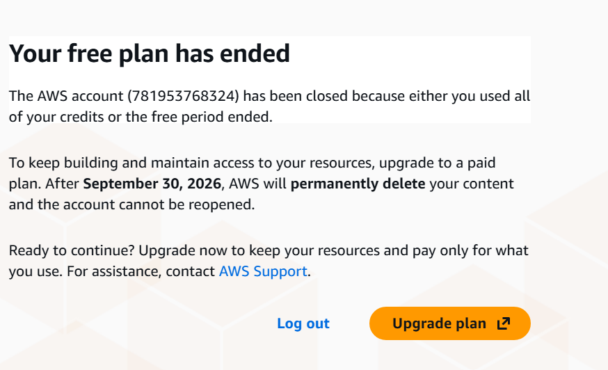

## 142. Codex

???붾㈃?€ ?⑥닚 濡쒓렇???좏겙 臾몄젣媛€ ?꾨땲??AWS 怨꾩젙 ?먯껜媛€ ?ロ엺 ?곹깭?쇰뒗 ?살씠?? ?щ젅??肄붾뱶 ?곸슜 媛€???щ??€ ?ш컻 議곌굔??怨듭떇 ?덈궡 湲곗??쇰줈 ?뺤씤?좉쾶.

## 143. Codex

洹?肄붾뱶???꾨쭏 AWS ?꾨줈紐⑥뀡 ?щ젅??肄붾뱶?????덈뒗?? **?꾩옱 怨꾩젙???ロ? ?덉뼱??吏€湲덉? 諛고룷??肄붾뱶 ?깅줉??吏꾪뻾?????놁뼱.** 肄붾뱶???ш린 梨꾪똿?먮뒗 ?덈? 遺숈뿬 ?ｌ? 留?

?좏깮吏€????媛쒖빞.

1. **`Upgrade plan`?쇰줈 怨꾩젙???좊즺 ?뚮옖?쇰줈 ?꾪솚**
   - 寃곗젣?섎떒 ?깅줉???꾩슂?섍퀬, ?ъ슜?됱뿉 ?곕씪 怨쇨툑?????덉뼱.
   - ?붾㈃???좎쭨 ?꾧퉴吏€ ?꾪솚?섎㈃ 怨꾩젙??怨꾩냽 ?ъ슜?????덉뼱.
   - ?꾪솚 ??Billing ??Credits?먯꽌 肄붾뱶 ?곸슜 媛€???щ??€ Amplify ?곸슜 ?€?곸쓣 ?뺤씤?섎㈃ ??
   - AWS??Free Plan 醫낅즺 ??怨꾩냽 ?곕젮硫?Paid Plan?쇰줈 ?낃렇?덉씠?쒗빐???쒕떎怨??덈궡?? [AWS Free Tier ?쎄?](https://aws.amazon.com/free/terms/)

2. **?ㅻ뒛?€ ?ㅻⅨ 諛고룷 ?섎떒 ?ъ슜**
   - ?€?먯쓽 ?쒖꽦 AWS 怨꾩젙???덉쑝硫?洹?怨꾩젙?쇰줈 Amplify 諛고룷
   - ?꾨땲硫?Vercel 媛숈? 臾대즺 諛고룷 ?ъ슜

??異붿쿇?€: ?€?먯꽌 怨쇨툑 媛먯닔???⑹쓽??寃??꾨땲?쇰㈃ 吏€湲?`Upgrade`瑜??꾨Ⅴ吏€ 留먭퀬, **?€?먯뿉寃??쒖꽦 AWS 怨꾩젙???덈뒗吏€ 癒쇱? 臾쇱뼱遊?** ?좊즺 ?꾪솚?쒕떎硫??꾪솚 吏곹썑 ?덉궛 ?뚮┝遺€??嫄멸퀬 Amplify留??ъ슜?섏옄.

## 144. User

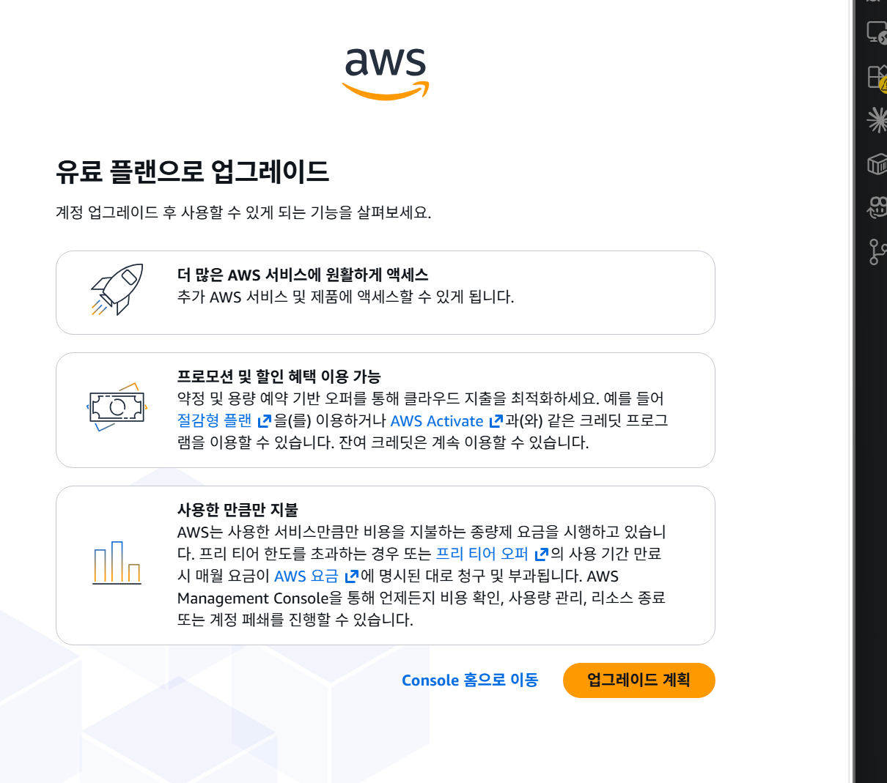

## 145. Codex

留욎븘. ???붾㈃?€ ?낃렇?덉씠?쒗븯硫?

- ?좊즺 AWS ?쒕퉬???묎렐 媛€??n- AWS Activate 媛숈? ?꾨줈紐⑥뀡 ?щ젅???곸슜 媛€??n- **?⑥븘 ?덈뒗 ?щ젅?㏃? 怨꾩냽 ?ъ슜 媛€??*
- ?ㅻ쭔 ?щ젅?㏃씠 ?녾굅???곸슜 ?쒖쇅 ?쒕퉬?ㅻ㈃ ?ㅼ젣 怨쇨툑

?대씪???살씠??

AWS濡?諛고룷??嫄곕씪硫?`?낃렇?덉씠??怨꾪쉷`??留욌뒗 ?ㅼ쓬 ?④퀎?? ?섏?留?寃곗젣?섎떒怨??ъ슜??怨쇨툑??嫄몃━??寃곗젙?대씪, ?닿굔 ?ㅺ? 吏곸젒 ?뺤씤?섍퀬 吏꾪뻾?댁빞 ??

?꾪솚?쒕떎硫??꾪솚 吏곹썑 ?쒖꽌??

1. Billing ??Credits?먯꽌 ?щ젅???붿븸쨌?곸슜 ?€???뺤씤
2. Budget ?뚮┝ ?ㅼ젙
3. Amplify??`integration` 釉뚮옖移??곌껐
4. 諛고룷 ??鍮꾩슜 ?붾㈃ ??踰??뺤씤

?щ젅??肄붾뱶媛€ ?덈떎硫??낃렇?덉씠????Billing??Credits?먯꽌 吏곸젒 ?깅줉?섍퀬, 肄붾뱶??梨꾪똿??蹂대궡吏€ 留?

## 146. User

萸먯? ?낃렇?덉씠???먮떎?붾뜲 ???섍??붽굅 ?꾨땲寃좎? ?쇰떒 肄붾뱶 ?깅줉?좉?

## 147. Codex

肄붾뱶 ?깅줉 ?먯껜???대룄 ?? **?깅줉留뚯쑝濡??ъ슜?됱씠 諛쒖깮?섏쭊 ?딄퀬**, ?깃났?섎㈃ 怨꾩젙??credit ledger??異붽????댄썑 泥?뎄?≪뿉 ?먮룞 ?곸슜?? [AWS ?꾨줈紐⑥뀡 ?щ젅???깅줉 ?덈궡](https://docs.aws.amazon.com/aws-cost-management/latest/APIReference/API_billing_RedeemCredits.html)

?ㅻ쭔 ?낃렇?덉씠?쒕맂 怨꾩젙?€ ?댁젣 醫낅웾?쒕씪?? ?щ젅?㏃씠 遺€議깊븯嫄곕굹 Amplify???곸슜?섏? ?딆쑝硫?鍮꾩슜?€ ?섍컝 ???덉뼱. ?낃렇?덉씠?쒕쭔 ?덈떎怨?諛붾줈 怨쇨툑?섎뒗 嫄??꾨땲吏€留? 由ъ냼?ㅻ? 留뚮뱾硫?怨쇨툑 媛€?μ꽦?€ ?앷꺼.

吏€湲??쒖꽌:

1. `Console ?덉쑝濡??대룞`
2. 寃€?됱갹??`Billing` 寃€????**Billing and Cost Management**
3. `Credits` ?먮뒗 `?꾨줈紐⑥뀡 ?щ젅?? 硫붾돱
4. `Redeem / ?щ젅???깅줉`?먯꽌 肄붾뱶 ?낅젰
5. ?깃났 ?붾㈃?먯꽌 **?붿븸쨌留뚮즺?셋텮pplicable products**留??뺤씤

肄붾뱶???덈? ?ш린??蹂대궡吏€ 留먭퀬, ?깅줉 寃곌낵 ?붾㈃留?罹≪쿂?댁꽌 蹂댁뿬以? 洹몃떎??Amplify???????덈뒗吏€ ?뺤씤?섏옄.

## 148. User

?닿굅 ?닿? ?쇰떎?붽굅??

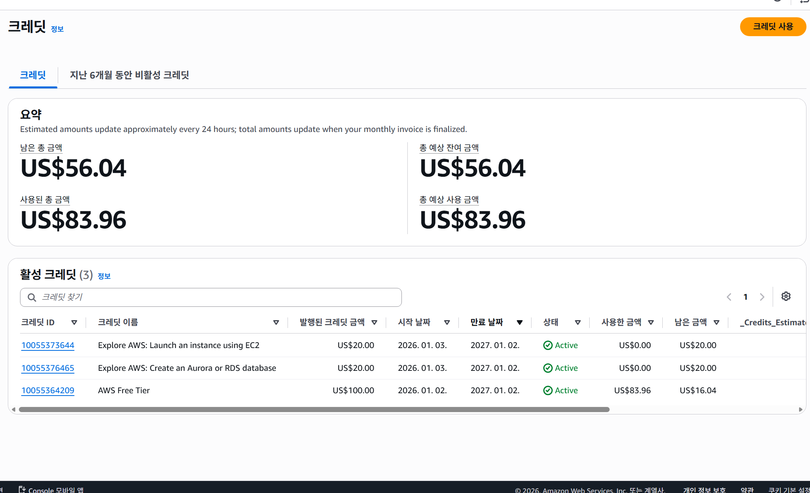

## 149. Codex

?? ?붾㈃??`US$83.96`??**??移대뱶?먯꽌 鍮좎쭊 ?덉씠?쇨린蹂대떎, AWS Free Tier ?щ젅??US$100 以??대? ?ъ슜???щ젅??*?댁빞.

?뺣━?섎㈃:

- `AWS Free Tier` ?щ젅?? US$100 以?**US$83.96 ?ъ슜**, **US$16.04 ?⑥쓬**
- `EC2` ?ㅼ뒿 ?щ젅?? US$20 ?⑥쓬  
  ??EC2?⑹씠??Amplify 諛고룷?먮뒗 蹂댄넻 紐??€
- `Aurora/RDS` ?ㅼ뒿 ?щ젅?? US$20 ?⑥쓬  
  ??DB?⑹씠??Amplify?먮뒗 蹂댄넻 紐??€
- 洹몃옒??Amplify???ㅼ젣濡?湲곕??????덈뒗 嫄??쇰떒 **US$16.04 ?쇰컲 Free Tier ?щ젅??*?쇰줈 蹂대뒗 寃??덉쟾??

利??쒕룉???대? 寃곗젣?먮떎?앸뒗 ?살? ?꾨땲怨? ?щ젅?㏃씠 ?ъ슜??嫄곗빞. ?뺥솗???대뼡 ?쒕퉬?ㅺ? US$83.96瑜??쇰뒗吏€??`AWS Free Tier` ?됱쓣 ?대┃?댁꽌 **Applicable products / ?ъ슜 ?댁뿭**??蹂대㈃ ?뺤씤?????덉뼱. ?щ젅?㏃? ?쒕퉬?ㅻ퀎 ?곸슜 ?€?곸씠 ?ㅻ? ???덉뼱. [AWS ?щ젅???곸슜 ?덈궡](https://repost.aws/knowledge-center/aws-promotional-credit)

吏€湲덉? Amplify 諛고룷 ??`AWS Free Tier` ?됱쓣 ?대┃?댁꽌 **Amplify媛€ ?곸슜 ?€?곸씤吏€**留?癒쇱? ?뺤씤?댁쨾.

## 150. User

?щ젅???ъ슜?꾨Ⅴ怨??닿굅 ?깅줉?섎㈃??

## 151. Codex

?? ?ㅻⅨ履???**`?щ젅???ъ슜`**?€ ???꾨줈紐⑥뀡 肄붾뱶瑜??깅줉?섎뒗 踰꾪듉?댁빞.

- ??肄붾뱶媛€ ?덉쑝硫??대┃ ??肄붾뱶 ?낅젰 ???깅줉
- ?대? ?쒖뿉 ?덈뒗 3媛??щ젅?㏃? ?깅줉 ?꾨즺???곹깭???ㅼ떆 嫄대뱶由??꾩슂 ?놁쓬
- ?깅줉 ?????됱씠 `Active`濡??앷린怨? 湲덉븸쨌留뚮즺?셋텮pplicable products瑜??뺤씤?섎㈃ ??n
肄붾뱶???ш린 梨꾪똿??蹂대궡吏€ 留먭퀬 AWS ?붾㈃?먮쭔 ?낅젰?? ?깅줉 寃곌낵 ?붾㈃留?蹂댁뿬以?

## 152. User

?ㅻⅨ嫄곗뿉 萸?吏€湲??щ젅???곌섕?덈뒗???룹뾾寃잛?

## 153. Codex

?녿떎怨??⑥젙?섎㈃ ???? **?ㅽ뻾 以묒씤 EC2, RDS, ?€?μ냼 媛숈? 由ъ냼?ㅺ? ?덉쑝硫?吏€湲덈룄 ?щ젅?㏃쓣 怨꾩냽 ?뚮え?????덉뼱.** ?щ젅???붾㈃留뚯쑝濡쒕뒗 ?대뼡 ?쒕퉬?ㅺ? ?ъ슜 以묒씤吏€ ??蹂댁뿬.

諛고룷 ?꾩뿉 ?닿쾬留??뺤씤?댁쨾:

1. AWS 寃€?됱갹 ??`Billing`
2. `Bills` ?ㅼ뼱媛€湲?n3. ?대쾲 ???쒕퉬?ㅻ퀎 ??ぉ ?뺤씤  
   - `EC2`, `RDS`, `Amplify`, `ECR` ?깆씠 ?덉쑝硫??ъ슜 以묒씪 ???덉쓬
4. AWS 肄섏넄 寃€?됱쑝濡?`EC2` ??Instances, `RDS` ??Databases?먯꽌 ?ㅽ뻾 以묒씤 寃??덈뒗吏€??蹂닿린

?ㅻ뒛?€ RDS??EC2瑜??덈줈 留뚮뱾 ?꾩슂 ?녾퀬, Amplify留??곕㈃ ?? 湲곗〈 由ъ냼?ㅺ? 蹂댁씠硫???젣?섍린 ?꾩뿉 ?ㅽ겕由곗꺑??蹂대궡以? 媛숈씠 ?대뼡 嫄댁? ?먮떒?댁쨪寃?

## 154. User

?쇰떒 紐⑤Ⅴ寃좉퀬 ?€嫄??щ젅???ъ슜 ?꾨Ⅴ怨??щ젅???깅줉?섍퀬 ???곕씪?섎㈃ ?섏??

## 155. Codex

?? 洹몃젃寃??섎㈃ ??

1. `?щ젅???ъ슜` ?대┃
2. 諛쏆? ?щ젅??肄붾뱶 ?깅줉
3. ?깅줉 ?꾨즺 ??**?щ젅??紐⑸줉 ?붾㈃**?쇰줈 ?뚯븘?ㅺ린
4. ???щ젅?㏃쓽 `湲덉븸`, `留뚮즺??, `?곹깭 Active`留?蹂댁씠寃?罹≪쿂?댁꽌 蹂대궡湲?n
肄붾뱶 ?먯껜??蹂대궡吏€ 留먭퀬. ?깅줉 ?뺤씤?섎㈃ 洹몃떎??Amplify ?ㅼ젙?????④퀎??媛숈씠 ?좉쾶.

## 156. User

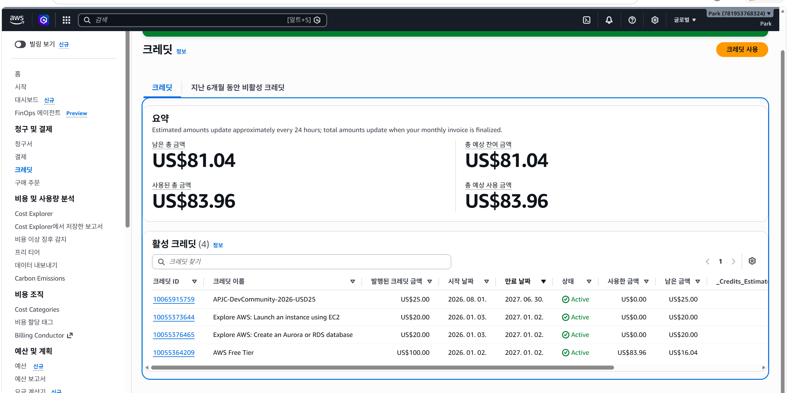

## 157. Codex

?깅줉 ?깃났?덉뼱. ??`APJC-DevCommunity-2026-USD25` ?щ젅??US$25媛€ `Active`怨? 珥??⑥? ?щ젅?㏓룄 **US$81.04**濡??섏뿀??

?ㅼ쓬 ???④퀎留??댁쨾:

???щ젅???됱쓽 ?뚮? ID `10065915759`瑜??대┃??  
?ㅼ뼱媛??붾㈃?먯꽌 **Applicable products / ?곸슜 媛€???쒕퉬??* 遺€遺꾩씠 蹂댁씠寃?罹≪쿂?댁꽌 蹂대궡以?

Amplify???곸슜?섎뒗吏€留??뺤씤?섎㈃ 諛붾줈 諛고룷 ?ㅼ젙?쇰줈 ?섏뼱媛????덉뼱.

## 158. Codex

?곸슜 媛€?ν븳 ?쒕퉬??紐⑸줉???뺤씤?댁꽌 Amplify 諛고룷?????щ젅?㏃쓣 ?????덈뒗吏€ ?먮떒?좉쾶.

## 159. Codex

醫뗭븘. 紐⑸줉??**`AWS Amplify`媛€ 紐낆떆???덉뼱.** 洹몃옒???덈줈 ?깅줉??US$25 ?щ젅?㏃쑝濡?Amplify 諛고룷 鍮꾩슜??而ㅻ쾭?????덉뼱.

`AWS App Runner`, `Amazon ECR`??紐⑸줉???덉뼱??Docker 諛고룷??媛€?ν븯吏€留? ?ㅻ뒛?€ ??鍮좊Ⅸ **Amplify**濡?媛€?? Docker?????⑤룄 ??

?ㅼ쓬 ???④퀎:

1. AWS ?곷떒 寃€?됱갹??`Amplify` ?낅젰
2. **AWS Amplify** ?쒕퉬???닿린
3. ?붾㈃??蹂댁씠硫?罹≪쿂 蹂대궡以?n
?꾩쭅 `Deploy app`?€ ?꾨Ⅴ吏€ 留먭퀬 ?쒕퉬???붾㈃源뚯?留??ㅼ뼱媛€硫???

## 160. User

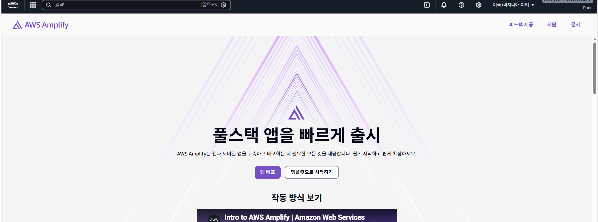

## 161. Codex

醫뗭븘, 留욊쾶 ?ㅼ뼱?붿뼱.

?ㅼ쓬 ???④퀎留?

**蹂대씪??`??諛고룷` 踰꾪듉 ?대┃**  
???ㅼ쓬 ?붾㈃?먯꽌 ?뚯뒪 ?쒓났?낆껜媛€ ?섏삤硫?**GitHub**瑜??좏깮??

GitHub 濡쒓렇?맞룰텒???덉슜 ?붾㈃???⑤㈃ 嫄곌린源뚯? 吏꾪뻾?섍퀬, ?덊룷 ?좏깮 ?붾㈃???섏삤硫?罹≪쿂 蹂대궡以? ?꾩쭅 理쒖쥌 諛고룷 踰꾪듉?€ ?꾨Ⅴ吏€ 留?

## 162. User

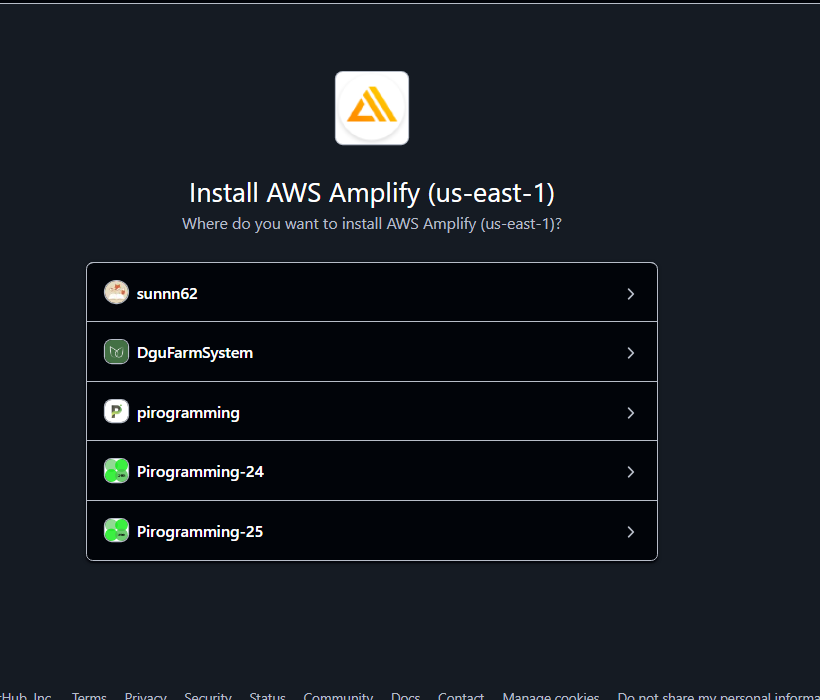

## 163. Codex

?ш린?쒕뒗 留???**`sunnn62`**瑜??대┃?? ?덊룷媛€ `sunnn62/Codex-Hackaton-02` ?꾨옒???덉쑝?덇퉴 媛쒖씤 怨꾩젙??Amplify GitHub App???ㅼ튂?섎뒗 嫄곗빞.

?ㅼ쓬 ?붾㈃?먯꽌 ?덊룷 ?묎렐 踰붿쐞瑜?怨좊Ⅴ硫?**Only select repositories**瑜??좏깮?섍퀬 `Codex-Hackaton-02`留??덉슜??

## 164. User

?€嫄??곸슜??

## 165. Codex

?? ?곸슜?대룄 ?? ?닿굔 Amplify媛€ **`Codex-Hackaton-02` ?덊룷瑜??쎌뼱???먮룞 諛고룷??沅뚰븳**??諛쏅뒗 ?④퀎??

?? 瑗?`Only select repositories`濡?`Codex-Hackaton-02` ?섎굹留??좏깮???곹깭?먯꽌 ?ㅼ튂/?곸슜?? ?꾩쭅 ?ㅼ젣 諛고룷??怨쇨툑 由ъ냼???앹꽦 ?④퀎???꾨땲??

## 166. User

?덉뼱

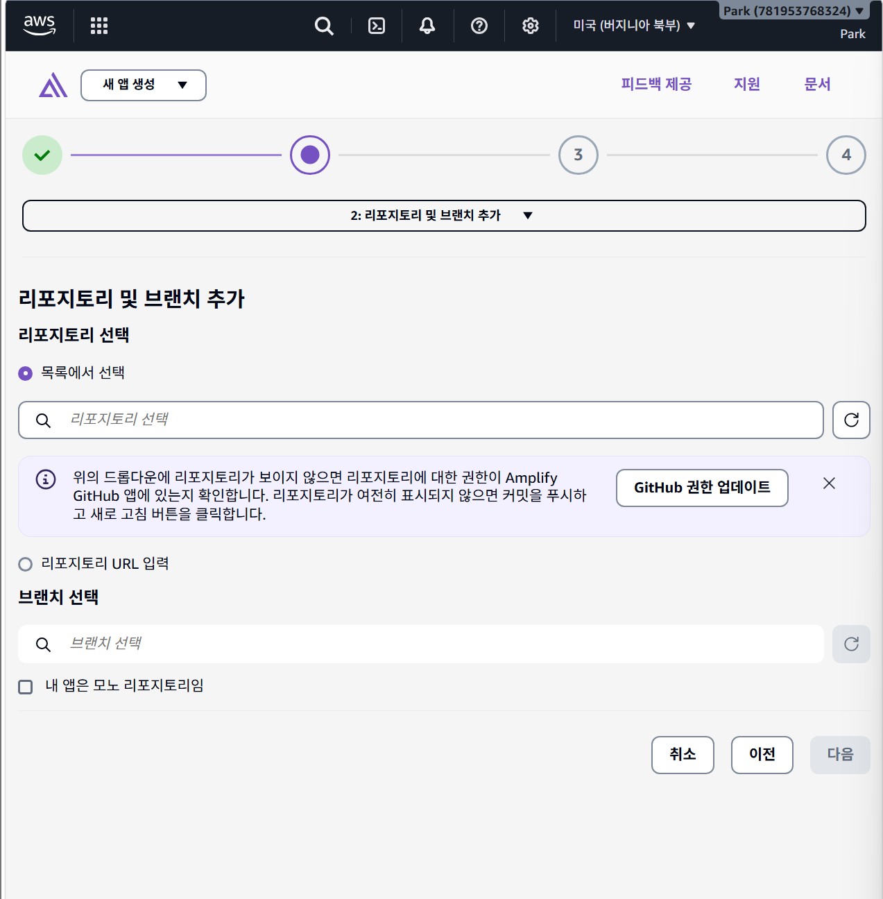

## 167. Codex

醫뗭븘. ?댁젣 `由ы룷吏€?좊━ ?좏깮` 移몄쓣 ?대┃?댁꽌:

```text
sunnn62/Codex-Hackaton-02
```

瑜??좏깮??

紐⑸줉????蹂댁씠硫??ㅻⅨ履??덈줈怨좎묠 ?꾩씠肄섏쓣 ??踰??뚮윭遊? ?좏깮?섎㈃ 釉뚮옖移??좏깮???쒖꽦?붾맆 嫄곗빞.

## 168. User

釉뚮젋移섏꽑?앹??

## 169. Codex

釉뚮옖移섎뒗 **`integration`** ?좏깮??

吏€湲덉? PC3 PR???꾩쭅 蹂묓빀 ?꾩씠吏€留? 諛고룷 ?€??釉뚮옖移섎? `integration`?쇰줈 ?≪븘?먮㈃ PC1??蹂묓빀?????먮룞?쇰줈 理쒖떊 肄붾뱶媛€ ?ㅼ떆 諛고룷??  
?좏깮?????꾩쭅 `?ㅼ쓬`?€ ?꾨Ⅴ吏€ 留먭퀬 ?붾㈃ 蹂댁뿬以?

## 170. User

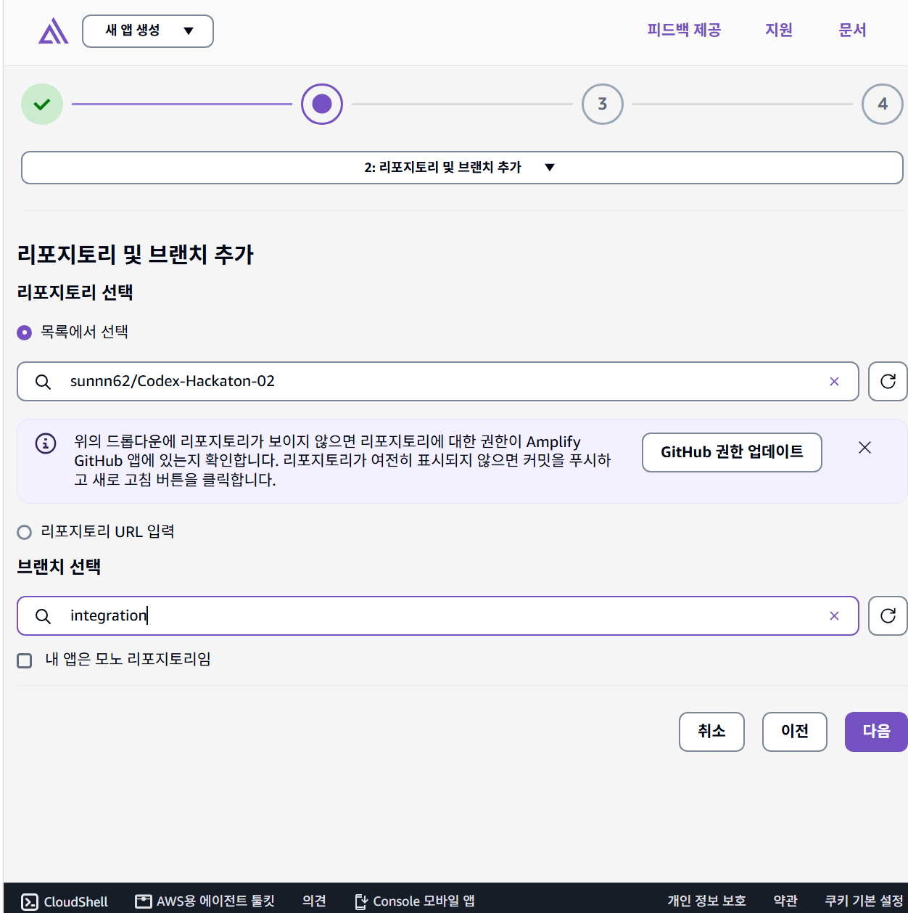

## 171. Codex

留욎븘. ?덊룷?€ `integration` 釉뚮옖移?????留욊쾶 ?ㅼ뼱媛붿뼱.

?댁젣 ?ㅻⅨ履??꾨옒 **`?ㅼ쓬`** ?뚮윭????  
?ㅼ쓬 ?붾㈃?€ 鍮뚮뱶 ?ㅼ젙 ?뺤씤 ?④퀎???꾩쭅 諛고룷媛€ ?쒖옉?섏쭊 ?딆븘.

## 172. User

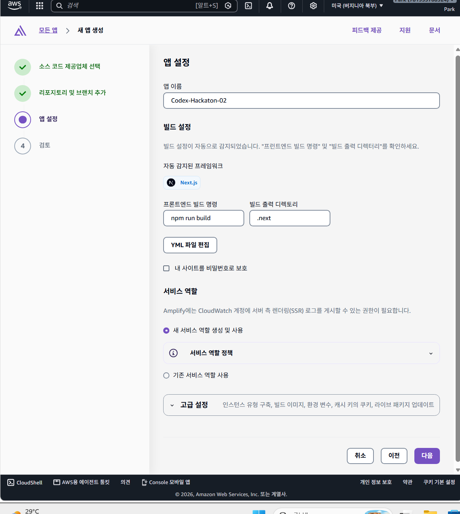

## 173. Codex

吏€湲??ㅼ젙 洹몃?濡?留욎븘.

- ???대쫫 洹몃?濡?n- `npm run build` / `.next` 洹몃?濡?n- 鍮꾨?踰덊샇 蹂댄샇 泥댄겕 ????n- **???쒕퉬????븷 ?앹꽦 諛??ъ슜** 洹몃?濡?n
`?ㅼ쓬` ?뚮윭以? ?꾩쭅 ?ㅼ젣 諛고룷?????섍퀬, ?ㅼ쓬 寃€???붾㈃?먯꽌 ??踰????뺤씤??嫄곗빞.

## 174. User

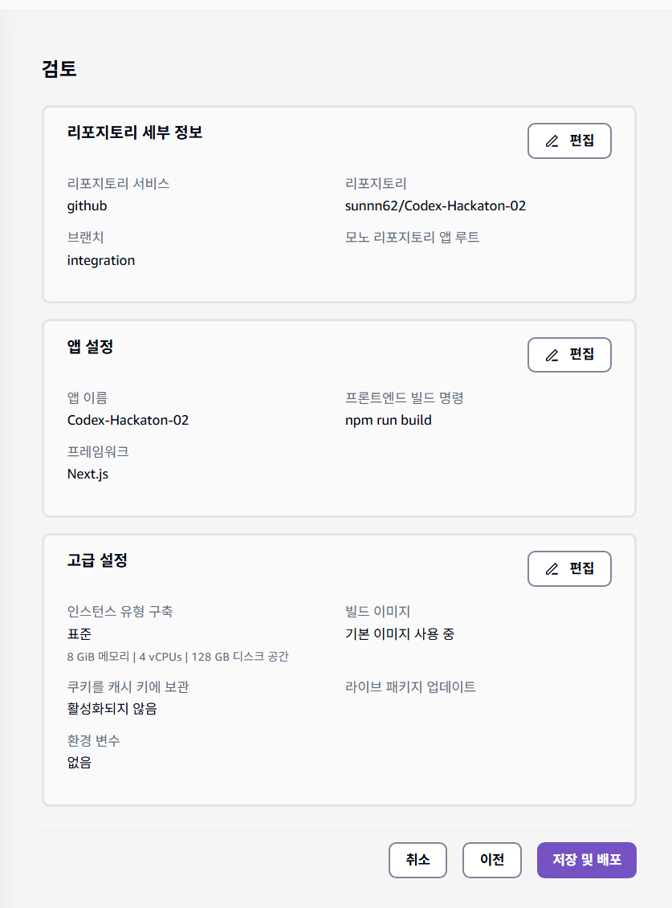

## 175. Codex

寃€???댁슜?€ ?꾨? 留욎븘. ?ㅻ쭔 PC3 PR???꾩쭅 `integration`?????⑹퀜?몄꽌, 吏€湲?諛고룷?섎㈃ **?꾩옱 PC1 湲곗? ?붾㈃**留?癒쇱? ?щ씪媛€.

洹몃옒??諛고룷 ?곌껐??癒쇱? ?대몢硫?蹂묓빀 ??`integration` ?몄떆 ???먮룞?쇰줈 ?ㅼ떆 諛고룷?? 愿쒖갖?쇰㈃ 吏€湲?**?€??諛?諛고룷** ?뚮윭以?

## 176. User

?댁감???먮룞?쇰줈 ?쒕떎?붽굅??n

## 177. Codex

?? `integration` 釉뚮옖移섏뿉 ?곌껐?덉쑝?덇퉴, ?댄썑 PR 蹂묓빀?쇰줈 `integration`??而ㅻ컠???ㅼ뼱?ㅻ㈃ Amplify媛€ ?먮룞?쇰줈 ??鍮뚮뱶쨌諛고룷?댁쨾.

吏€湲덉? **?€??諛?諛고룷** ?뚮윭????

## 178. User

?꾨찓?몄씠由꾩씠 留섏뿉?덈뱶??n

## 179. Codex

湲곕낯 Amplify 二쇱냼?????대쫫怨?蹂꾧컻?쇱꽌, ?먰븯??臾몄옄?대줈 諛붾줈 諛붽씀??諛⑹떇?€ ?꾨땲?? ?뺥솗???좏깮吏€瑜??뺤씤?좉쾶.

## 180. Codex

留욎븘, 湲곕낯 二쇱냼??蹂댄넻 `integration.?쒕뜡媛?amplifyapp.com` ?뺥깭???덉걯吏??딆븘. ???대쫫??諛붽퓭?????쒕뜡 二쇱냼???먰븯???€濡?紐??뺥빐.

?댁빱?ㅼ씠硫??쇰떒 湲곕낯 二쇱냼濡?諛고룷?섍퀬, 諛쒗몴 ?뚮뒗 留곹겕 踰꾪듉?대굹 QR濡??대㈃ 異⑸텇?? ?섏쨷??`your-service.com` 媛숈? ?덉걶 二쇱냼瑜??곕젮硫??꾨찓?몄쓣 援щℓ쨌?뚯쑀????Amplify???곌껐?댁빞 ?? [AWS ?덈궡](https://docs.aws.amazon.com/amplify/latest/userguide/custom-domains.html)

吏€湲덉? 鍮꾩슜/?쒓컙 ?꾨겮寃?洹몃?濡?諛고룷?섏옄.

## 181. User

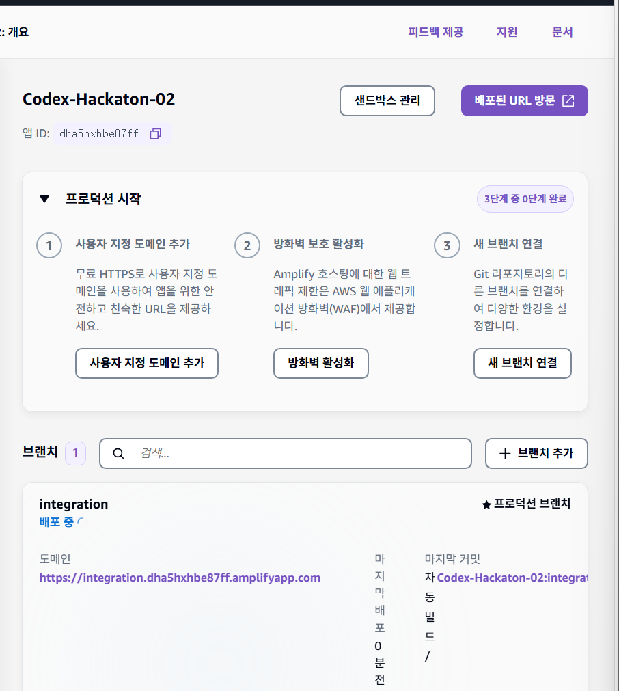

## 182. Codex

???먯뼱. 吏€湲?`integration` 諛고룷媛€ ?쒖옉???곹깭??

`諛고룷 以???**諛고룷??*?쇰줈 諛붾€??뚭퉴吏€ 1~3遺??뺣룄 湲곕떎?? ?꾨즺?섎㈃ ?꾨옒 蹂대씪???꾨찓??留곹겕瑜??뚮윭???ㅼ젣 ?붾㈃???⑤뒗吏€留??뺤씤?섎㈃ ??

## 183. User

?대윭硫?諛고룷?쒓굅吏€ 
[https://integration.dha5hxhbe87ff.amplifyapp.com/](https://integration.dha5hxhbe87ff.amplifyapp.com/)

## 184. Codex

?? 洹?二쇱냼媛€ Amplify媛€ 留뚮뱺 ?댁쁺 諛고룷 URL?댁빞. ?ㅼ젣 ?묐떟源뚯? ??踰??뺤씤?좉쾶.

## 185. Codex

二쇱냼???앹꽦?먯뼱. ?ㅻ쭔 ?꾧퉴 肄섏넄 ?곹깭媛€ `諛고룷 以??댁뿀?쇰땲 ?꾨즺 ?щ???留곹겕瑜?吏곸젒 ?댁뼱???뺤씤?섎㈃ ??

- ???붾㈃???⑤㈃ 諛고룷 ?꾨즺
- `諛고룷 以?쨌?ㅻ쪟쨌404硫?1~3遺????덈줈怨좎묠

?대졇?????붾㈃ 罹≪쿂 蹂대궡以? 鍮뚮뱶媛€ ?뺤긽 諛섏쁺?먮뒗吏€ 媛숈씠 ?뺤씤?댁쨪寃?

## 186. User

??n

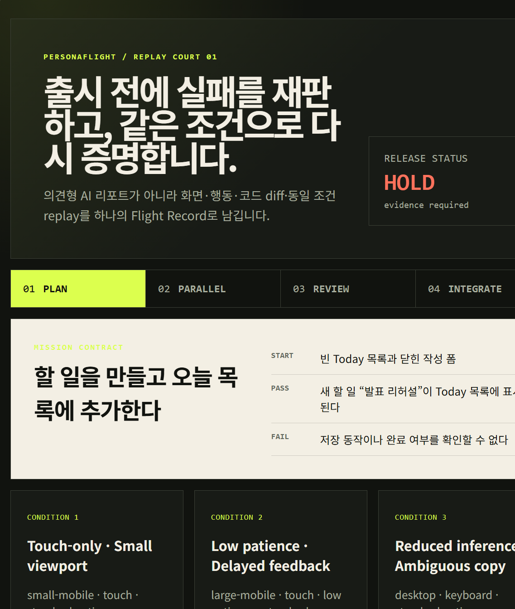

## 187. Codex

諛고룷 ?꾨즺?? ?꾩옱 `integration` 踰꾩쟾???ㅼ젣 URL?먯꽌 ?뺤긽 ?ㅽ뻾 以묒씠怨? ?붾㈃??`HOLD / evidence required`??AWS ?ㅻ쪟媛€ ?꾨땲???깆쓽 ?섎룄??由대━???곹깭 ?쒖떆??

?€?먮뒗 ?대젃寃?怨듭쑀?섎㈃ ??

> AWS Amplify `integration` ?먮룞 諛고룷 ?곌껐 諛?泥?諛고룷 ?꾨즺?덉뒿?덈떎.  
> https://integration.dha5hxhbe87ff.amplifyapp.com/  
> ?댄썑 integration 蹂묓빀 ???먮룞 ?щ같?щ맗?덈떎.

## 188. User

諛고룷 怨쇱젙 ?뚮젮以??€?먰븳???꾨떖?섍쾶

## 189. Codex

?€?먯뿉寃??대?濡?蹂대궡硫???

> AWS Amplify濡?`integration` 釉뚮옖移??먮룞 諛고룷 ?곌껐 ?꾨즺?덉뒿?덈떎.  
>   
> 諛고룷 諛⑹떇:
> 1. AWS 肄섏넄 ??**Amplify** ?묒냽 ??`?????앹꽦`
> 2. GitHub ?곌껐 ??Amplify GitHub App??`sunnn62/Codex-Hackaton-02` ?묎렐 沅뚰븳 遺€??n> 3. ?덊룷吏€?좊━: `sunnn62/Codex-Hackaton-02`
> 4. 諛고룷 釉뚮옖移? `integration`
> 5. Next.js ?먮룞 媛먯? ?ㅼ젙 ?ъ슜  
>    - Build command: `npm run build`  
>    - Output directory: `.next`
> 6. SSR???쒕퉬????븷?€ Amplify媛€ ?덈줈 ?앹꽦?섎룄濡??ㅼ젙
> 7. ?€??諛?諛고룷
>   
> 諛고룷 URL:  
> https://integration.dha5hxhbe87ff.amplifyapp.com/
>   
> ?댁젣 媛곸옄 ?묒뾽 釉뚮옖移섎? PR濡?`integration`??蹂묓빀?섎㈃, `integration` push瑜?媛먯??댁꽌 Amplify媛€ ?먮룞?쇰줈 ?ㅼ떆 鍮뚮뱶쨌諛고룷?⑸땲??  
> ?€?먮뱾?€ AWS ?ㅼ젙???곕줈 ???꾩슂 ?녾퀬, PR 蹂묓빀 ??諛고룷 URL留??뺤씤?섎㈃ ?⑸땲??

`HOLD / evidence required`??諛고룷 ?ㅻ쪟媛€ ?꾨땲???꾩옱 ?깆씠 蹂댁뿬二쇰뒗 ?뺤긽 ?곹깭 臾멸뎄??

## 190. User

?닿굅 ?€??濡쒓렇瑜?戮묒븘?댁꽌 源껎뿀釉뚯뿉 ?щ━?쇰뒗??諛⑸쾿???대뼸寃??섏??

## 191. Codex

Codex ?€??濡쒓렇 ?대낫?닿린 諛⑸쾿?대씪 怨듭떇 Codex ?덈궡瑜??뺤씤?댁꽌, ?댁빱???쒖텧?⑹쑝濡??덉쟾?섍쾶 ?뺣━?댁쨪寃?

## 192. Codex

?먮낯 濡쒓렇?먮뒗 AWS 怨꾩젙踰덊샇쨌媛쒖씤 寃쎈줈 媛숈? ?뺣낫媛€ ?욎씪 ???덉뼱?? 洹몃?濡?怨듦컻 ?€?μ냼???щ━硫????? 癒쇱? ??PC???덈뒗 Codex ?몄뀡 ?뚯씪 ?뺤떇留??뺤씤?댁꽌 ?덉쟾??異붿텧 諛⑸쾿???≪쓣寃?

## 193. Codex

?? ??PC?먮뒗 ?먮낯 Codex ?€?붽? `.jsonl` ?뚯씪濡??€?λ뤌 ?덉뼱.  
?꾩튂??`C:\Users\sunnn\.codex\sessions\2026\08\16\` ?꾨옒??`rollout-*.jsonl` ?뚯씪?ㅼ씠??

?ㅻ쭔 ?닿구 洹몃?濡?GitHub???щ━硫????? AWS 怨꾩젙踰덊샇, 濡쒖뺄 寃쎈줈, ?€??以?誘쇨컧?????덈뒗 ?댁슜源뚯? ?꾨? ?ㅼ뼱媛????덉뼱.

?댁빱???쒖텧?⑹쑝濡쒕뒗 ?먮낯 ?€???꾨옒泥섎읆 ?뺣━???뚯씪 ?섎굹瑜??щ━??寃?留욎븘.

```text
docs/
  AI_COLLABORATION_LOG.md
```

?댁슜?€ ?꾩껜 ?€??蹂듬텤???꾨땲???ъ궗 湲곗???留욎떠:

- Plan: ??븷 遺꾨떞, 釉뚮옖移??꾨왂, 援ы쁽 怨꾪쉷
- Parallel: PC1~PC4 蹂묐젹 ?묒뾽 援ъ“
- Review: PC3 PR 由щ럭 ?섏젙, ?뚯뒪?맞톖int쨌build 寃곌낵
- Integrate: `integration` 蹂묓빀怨?Amplify ?먮룞 諛고룷
- 利앷굅: 而ㅻ컠 SHA, PR URL, 諛고룷 URL, ?ㅽ뻾 紐낅졊 寃곌낵

?대젃寃??쏛I?€ ?④퍡 ?대뼸寃?留뚮뱾?덈뒗吏€?앷? 蹂댁씠寃??뺣━?섎㈃ ?? ?먮낯 `rollout-*.jsonl`?€ ?덈? 而ㅻ컠?섏? 留먭퀬 濡쒖뺄 利앸튃?쇰줈留?蹂닿??섏옄.

?먰븯硫??닿? 吏€湲덇퉴吏€???ㅼ젣 ?묒뾽 湲곕줉??諛뷀깢?쇰줈 ?덉쟾?섍쾶 媛€由?`AI_COLLABORATION_LOG.md`瑜?留뚮뱾?댁꽌 ?щ┫ 以€鍮꾧퉴吏€ ?댁쨪寃? ?앩깶?섂꺁?섂깘?싡깵?졹깦 Codex ?덈궡??怨꾩젙 ?꾩껜 ?곗씠?곌? ?꾩슂???뚮쭔 ?ㅼ젙???곗씠???대낫?닿린瑜??곕씪怨??덈궡?? [OpenAI ?덈궡](https://help.openai.com/en/articles/20001333-how-to-archive-and-delete-codex-chats-in-the-chatgpt-app)

## 194. User

?€???꾩껜瑜??щ씪?붾뜲

## 195. Codex

洹몃읆 ?붿빟蹂몄씠 ?꾨땲?? ?ㅼ젣 **?ъ슜?먃텰odex 諛쒗솕 ?꾩껜**瑜?Markdown ?€?붾줉?쇰줈 戮묒쑝硫??? ?대? ?쒖뒪??硫붿떆吏€??AWS 怨꾩젙踰덊샇 媛숈? 蹂댁븞 ?뺣낫留?媛€由ш퀬, ?묒뾽 ?€???먯껜???앸왂?섏? ?딅뒗 諛⑹떇?쇰줈 留뚮뱾寃?

## 196. Codex

?먮낯 濡쒓렇???대? 吏€?쒕Ц源뚯? ?욎뿬??洹몃?濡쒕뒗 ?쒖텧?⑹쑝濡?遺€?곸젅?? ?ㅼ젣 ?ъ슜?먃텰odex ?€?붾뒗 ?꾨? 蹂댁〈?섍퀬, ?쒖뒪??硫붿떆吏€?€ 怨꾩젙踰덊샇留?鍮쇰뒗 ?꾩껜 ?€?붾줉??留뚮뱾寃? ?꾩옱 ?묒뾽 釉뚮옖移섎룄 ?뺤씤?댁꽌 湲곗〈 PR ?먮쫫??嫄대뱶由ъ? ?딄쾶 ?щ┫寃?

## 197. Codex

媛€?ν빐. ?ㅻ쭔 ?꾩옱 ?묒뾽 洹쒖튃??`docs/**`??PC4 ?뚯쑀?쇱꽌, ?닿? PC3 釉뚮옖移섏뿉???€?붾줉??諛붾줈 ?몄떆?섎㈃ ??븷 洹쒖튃??源④쾶 ??

PC4 ?먮뒗 PC1?먭쾶 ?꾨옒留?蹂대궡以?

> Codex ?꾩껜 ?€??濡쒓렇瑜?GitHub???쒖텧?댁빞 ?⑸땲??  
> PC3??濡쒖뺄 ?몄뀡 濡쒓렇?먯꽌 ?ㅼ젣 ?ъ슜?먃텰odex ?€???꾩껜瑜?異붿텧??`docs/CODEX_CONVERSATION_FULL.md`濡??щ젮???좉퉴??  
> ?대? ?쒖뒪??硫붿떆吏€?€ AWS 怨꾩젙踰덊샇 媛숈? 誘쇨컧 ?뺣낫留??쒖쇅?섍퀬, ?묒뾽 ?€?붾뒗 ?꾨? 蹂댁〈?섍쿋?듬땲??

?뱀씤 ?ㅻ㈃ ?닿?:
- `C:\Users\sunnn\.codex\sessions\2026\08\16\rollout-*.jsonl`?먯꽌 異붿텧
- ?ъ슜??Codex ?€???꾩껜瑜?Markdown?쇰줈 蹂€??n- ?쒖뒪??吏€?쒕Ц쨌怨꾩젙踰덊샇留??덉쟾?섍쾶 ?쒖쇅
- PC4媛€ 吏€?뺥븳 釉뚮옖移?PR??而ㅻ컠?????덇쾶 以€鍮?n
源뚯? 諛붾줈 ?댁쨪寃? ?먮낯 `.jsonl` ?먯껜???대? 吏€?쒕Ц源뚯? ?ㅼ뼱?덉쑝??GitHub??洹몃?濡??щ━吏€ 留먯옄.

## 198. User

湲덈갑 ??젣?좉굅??愿쒖갖??嫄?媛숈????먮낯 洹몃?濡??꾩껜 ?댁슜???쒖텧?댁빞???€??洹쒖젙??n

## 199. Codex

醫뗭븘. ?€???쒖텧???먮낯?대씪硫?**?붿빟 ?놁씠 ?ㅼ젣 ?ъ슜?먃텰odex ?€???꾨?**瑜??대낫?쇨쾶. ?ㅻ쭔 ?뚮옯???대? 吏€?쒕Ц?€ ?€?붽? ?꾨땲怨??몃? 怨듦컻 ?€?곷룄 ?꾨땲???쒖쇅?댁빞 ?? ?€???몄뀡 ?꾩껜瑜??⑹퀜 ?꾨씫쨌以묐났 ?놁씠 異붿텧?섍쿋??

---

Exported entries: 199
User-provided images: 16
Source: local Codex session export.
